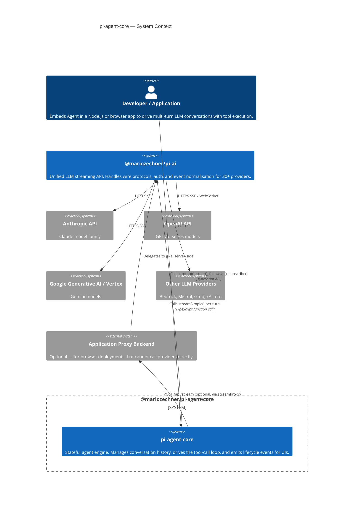

# C4 Level 1 — Context

This diagram answers the question: *what is `pi-agent-core` and who or what does it talk to?*

---

## Diagram

---

## Trust boundaries

| Boundary | Description |
|---|---|
| Application process | The application, `pi-agent-core`, and `pi-ai` run in the same Node.js process. API keys are passed via environment variables or `getApiKey` callback. |
| Provider network | `pi-ai` sends all LLM requests over HTTPS. `pi-agent-core` never holds credentials — it forwards them to `pi-ai` on each call. |
| Proxy boundary | When `streamProxy` is used, the application process communicates with its own backend over HTTPS. The backend holds provider credentials; the frontend holds only a short-lived auth token. |

---

## What pi-agent-core does NOT do

- No LLM wire protocol handling. Every actual HTTP request to a provider is made by `pi-ai`.
- No API key management or OAuth flows. Credential resolution is delegated to `pi-ai` or supplied via the `getApiKey` callback.
- No conversation persistence. The caller is responsible for serialising `agent.state.messages` to a database or file.
- No context window management. The caller provides a `transformContext` callback to prune old messages when the context grows too large.
- No rate limiting, retry logic, or quota management. These are handled by `pi-ai` and the provider.
- No UI rendering. The event stream is UI-framework agnostic.

---

## Who uses pi-agent-core

| Consumer | How |
|---|---|
| `@mariozechner/pi-coding-agent` | Creates an `Agent` with coding tools (read, write, bash, search). Renders events in `pi-tui`. |
| `@mariozechner/pi-mom` | Creates multiple `Agent` instances for multi-agent orchestration. |
| Custom applications | Instantiate `Agent` directly with application-specific tools and prompts. |

See also the [`pi-ai` context diagram](../ai/c4-01-context.md) for the layer below.
