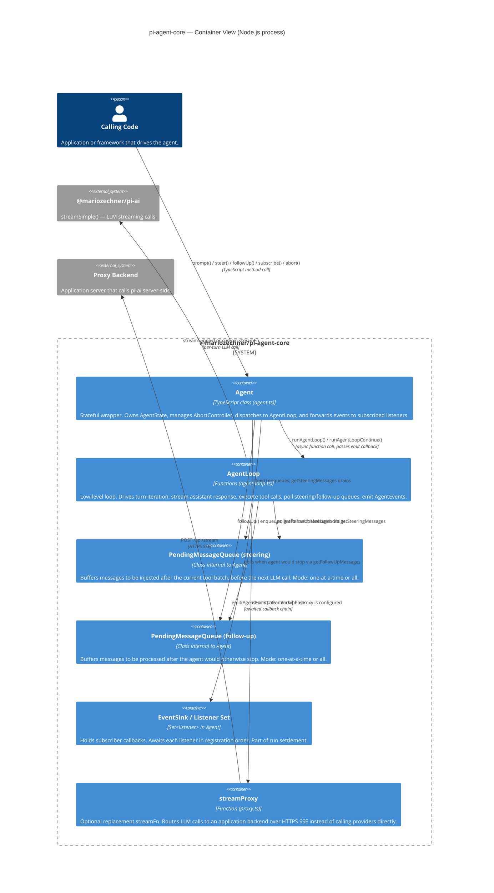

# C4 Level 2 — Container

This diagram answers the question: *what are the major sub-systems inside `pi-agent-core` and how do they collaborate?*

At this level a "container" means a coherent runtime component — a class, a queue, or a function group that has a clear responsibility. All containers shown here live inside the same Node.js process.

---

## Diagram



---

## Container responsibilities

### Agent (`agent.ts`)

The `Agent` class is the public entry point. It:

- Creates and maintains `AgentState` (system prompt, model, thinking level, tools, messages, streaming flags).
- Wraps every run in a lifecycle (`runWithLifecycle`) that creates an `AbortController`, sets `isStreaming`, and resolves a `waitForIdle` promise once all event listeners settle.
- Bridges the `steeringQueue` and `followUpQueue` into the loop configuration via `getSteeringMessages` and `getFollowUpMessages` callbacks.
- Reduces incoming `AgentEvent` values into `AgentState` mutations (e.g., pushes completed messages, adds/removes pending tool call IDs).
- Awaits subscribed listeners in registration order, making them part of run settlement.

### AgentLoop (`agent-loop.ts`)

The agent loop is stateless — it receives a context snapshot and configuration and returns new messages. It:

- Manages the outer loop (follow-up messages restart the outer loop) and inner loop (tool calls and steering messages drive the inner loop).
- Calls `streamAssistantResponse` on each turn, which applies `transformContext`, calls `convertToLlm`, and drives a `pi-ai` stream.
- Calls `executeToolCalls` when `stopReason === "toolUse"`, choosing parallel or sequential execution.
- Emits `AgentEvent` values through the `emit` callback after each significant phase.

The loop also exposes `agentLoop` and `agentLoopContinue` — variants that return an `EventStream<AgentEvent>` instead of taking an `emit` callback, for callers that prefer an async iterable interface.

### PendingMessageQueue

A tiny internal class with `enqueue`, `drain`, `hasItems`, and `clear`. Two instances live inside `Agent`: one for steering messages, one for follow-up messages. The `drain` method respects the queue's `mode`:

- `"one-at-a-time"` — returns at most one message per drain call (default).
- `"all"` — returns all queued messages in one drain call.

### EventSink / Listener Set

A `Set<listener>` held inside `Agent`. `subscribe()` adds to it and returns an unsubscribe function. Every `AgentEvent` emitted by the loop is forwarded here via `processEvents`, which first updates `AgentState`, then `await`s each listener. This sequential, awaited dispatch means listeners can perform async side effects (persistence, UI updates) as part of the run's settlement.

### streamProxy (`proxy.ts`)

An optional drop-in replacement for `streamSimple`. Instead of calling a provider directly, it:

1. `POST`s model, context, and options to `proxyUrl/api/stream` with a bearer token.
2. Reads the SSE response and reconstructs the `AssistantMessage` from compact delta events (the proxy strips the `partial` field to reduce bandwidth).
3. Returns a stream compatible with the `StreamFn` contract so `AgentLoop` never knows it is proxied.

---

## Data flow summary

```
caller.prompt("Hello")
  └─ Agent.runPromptMessages()
       └─ runAgentLoop(prompts, contextSnapshot, loopConfig, emit, signal, streamFn)
            ├─ [inner loop] streamAssistantResponse()
            │    ├─ transformContext()   (optional)
            │    ├─ convertToLlm()
            │    └─ streamFn()           → pi-ai → provider
            ├─ [if toolUse] executeToolCalls()
            │    ├─ prepareToolCall()    (validate args, beforeToolCall hook)
            │    ├─ executePreparedToolCall()
            │    └─ finalizeExecutedToolCall() (afterToolCall hook)
            └─ emit(AgentEvent)
                 └─ Agent.processEvents()
                      ├─ mutate AgentState
                      └─ await each listener
```
