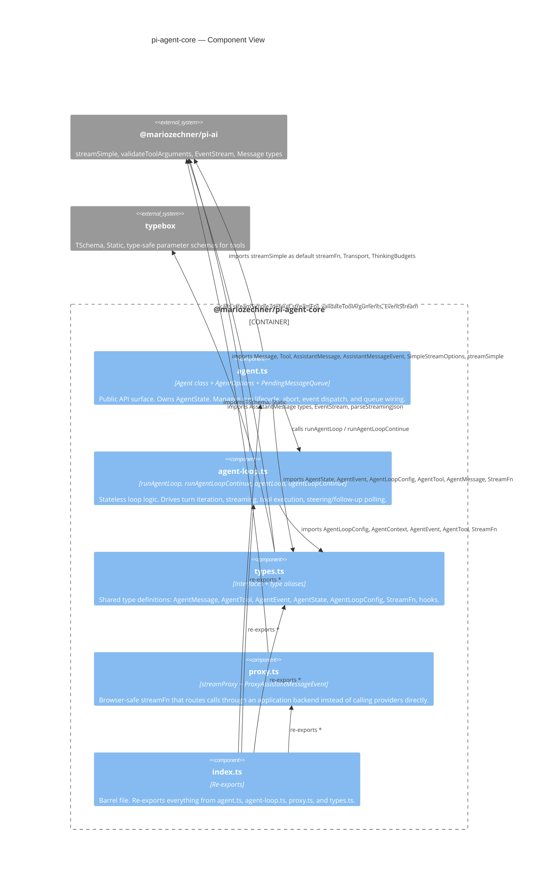

# C4 Level 3 — Component

This diagram answers the question: *what are the key modules inside `pi-agent-core` and how do they depend on each other?*

---

## Diagram

---

## Module responsibilities

### `types.ts`

The single source of truth for every type in the package. No runtime logic lives here — it is types all the way down. Key types:

| Type | Purpose |
|---|---|
| `AgentMessage` | Union of `Message` (from pi-ai) and custom app messages registered via declaration merging on `CustomAgentMessages`. |
| `AgentTool<TParameters, TDetails>` | Extends pi-ai's `Tool` with `label`, `prepareArguments`, `execute`, and per-tool `executionMode`. |
| `AgentToolResult<T>` | What `execute` must return: `content` for the LLM, `details` for the UI, and optional `terminate` flag. |
| `AgentEvent` | Discriminated union of all events emitted during a run. |
| `AgentState` | Publicly readable state interface with accessor properties for `tools` and `messages`. |
| `AgentLoopConfig` | Configuration bag passed to `runAgentLoop`. Extends `SimpleStreamOptions`. Contains all callbacks. |
| `StreamFn` | Type alias for the function signature that `agentLoop` calls per turn. Matches `streamSimple`'s signature. |
| `BeforeToolCallResult` / `AfterToolCallResult` | Return types for the `beforeToolCall` and `afterToolCall` hooks. |
| `BeforeToolCallContext` / `AfterToolCallContext` | Argument types for those same hooks. |
| `ThinkingLevel` | `"off" | "minimal" | "low" | "medium" | "high" | "xhigh"` — passed as `reasoning` to `streamSimple`. |
| `ToolExecutionMode` | `"sequential" | "parallel"` — controls how a tool batch is executed. |

### `agent.ts`

Contains three things:

1. **`AgentOptions`** — the constructor parameter bag. Every public field on `Agent` has a matching option here with a sensible default.
2. **`PendingMessageQueue`** — a private inner class. Holds an array of `AgentMessage` values and drains them in `"one-at-a-time"` or `"all"` mode.
3. **`Agent`** — the main class. Responsibilities:
   - Holds `MutableAgentState` (a private, writable form of `AgentState`).
   - Exposes `state` as a read-only `AgentState` getter.
   - Manages an `activeRun` record (`{ promise, resolve, abortController }`). Only one run can be active at a time.
   - Builds an `AgentLoopConfig` on each `prompt()` / `continue()` call, wiring queues as callbacks.
   - Dispatches `AgentEvent` values through `processEvents`, which first mutates state then awaits listeners.
   - Resolves `waitForIdle()` only after all `agent_end` listeners have settled and `finishRun` has cleared runtime state.

### `agent-loop.ts`

Contains the loop engine. Four public functions:

| Function | Returns | Use case |
|---|---|---|
| `runAgentLoop(prompts, context, config, emit, signal, streamFn)` | `Promise<AgentMessage[]>` | Agent class uses this. `emit` callback is awaited before moving to next phase. |
| `runAgentLoopContinue(context, config, emit, signal, streamFn)` | `Promise<AgentMessage[]>` | Same as above but without adding new prompt messages to context. |
| `agentLoop(prompts, context, config, signal, streamFn)` | `EventStream<AgentEvent, AgentMessage[]>` | Low-level API. Events are pushed to the stream asynchronously; listeners are NOT awaited. |
| `agentLoopContinue(context, config, signal, streamFn)` | `EventStream<AgentEvent, AgentMessage[]>` | Same as `agentLoop` but continuation variant. |

Internal private functions (not exported):

- `runLoop` — the shared while loop body used by both `runAgentLoop` and `runAgentLoopContinue`.
- `streamAssistantResponse` — applies `transformContext`, calls `convertToLlm`, drives a `streamFn` call, emits `message_start` / `message_update` / `message_end`.
- `executeToolCalls` — dispatches to `executeToolCallsSequential` or `executeToolCallsParallel`.
- `prepareToolCall` — resolves the tool, runs `prepareArguments`, validates with TypeBox, calls `beforeToolCall`.
- `executePreparedToolCall` — calls `tool.execute` with the `onUpdate` callback.
- `finalizeExecutedToolCall` — calls `afterToolCall` and merges overrides into the result.
- Helper creators: `createErrorToolResult`, `createToolResultMessage`, `shouldTerminateToolBatch`.

### `proxy.ts`

A self-contained SSE client for browser deployments. Key components:

- **`ProxyAssistantMessageEvent`** — a stripped-down event union. The proxy server omits the `partial` field from delta events; `streamProxy` reconstructs it client-side by accumulating deltas into a local `AssistantMessage`.
- **`streamProxy(model, context, options)`** — the drop-in `StreamFn`. Fetches `proxyUrl/api/stream`, reads SSE lines, processes each via `processProxyEvent`, and feeds them into a `ProxyMessageEventStream`.
- **`processProxyEvent`** — maps each `ProxyAssistantMessageEvent` variant to the matching `AssistantMessageEvent` while updating the shared `partial` object in place.

### `index.ts`

A barrel re-export: `export * from "./agent.js"`, `export * from "./agent-loop.js"`, `export * from "./proxy.js"`, `export * from "./types.js"`. All public API is accessible from `@mariozechner/pi-agent-core`.

---

## Dependency rules

- `types.ts` has no dependencies on other local modules. It only imports from `pi-ai` and `typebox`.
- `agent-loop.ts` imports from `types.ts` and `pi-ai`. It does not import from `agent.ts`.
- `agent.ts` imports from `agent-loop.ts` and `types.ts`. It does not import from `proxy.ts`.
- `proxy.ts` imports from `pi-ai` only. It has no local dependencies.
- `index.ts` imports from all four modules.

This means the dependency graph is a DAG: `types → (leaf)`, `agent-loop → types`, `agent → agent-loop + types`, `proxy → (pi-ai only)`, `index → all`.
