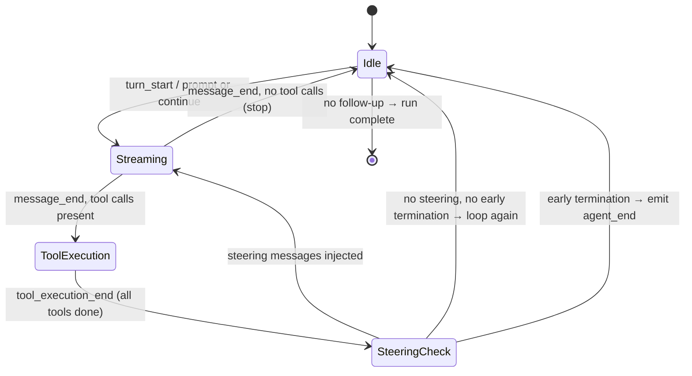

# Design Patterns

`pi-agent-core` is built on a small set of well-known patterns. Recognising them helps you reason about the code, predict behaviour, and extend the package correctly.

---

## Observer (publish / subscribe)

`Agent` maintains an internal list of `AgentEvent` listener callbacks. Listeners are added via `agent.subscribe()` (which returns an unsubscribe function) and removed when that function is called.

```
Agent
├── listeners: Set<(event: AgentEvent) => Promise<void>>
├── subscribe(fn) → () => void
└── emit(event)   → awaits all listeners sequentially
```

Every significant state transition emits an event so that any number of external observers (loggers, UI rendaters, metrics collectors, test assertions) can react without coupling to the loop internals.

**Key property:** `emit` is `await`ed at the `Agent` level (`runAgentLoop` / `runAgentLoopContinue`), so listeners can perform async I/O and the loop will not advance until all listeners have settled. Listeners registered on the low-level `agentLoop` / `agentLoopContinue` functions are NOT awaited (fire-and-forget).

See [observability.md](./observability.md) for the full event taxonomy and subscription examples.

---

## State machine (agent loop)

The outer loop in `runLoop` (`agent-loop.ts`) is a finite state machine with five logical states:



Each state is represented by a phase of the `runLoop` function:

| State | Code location | Entry condition |
|---|---|---|
| `Idle` | Top of `while (true)` | Fresh start or after tool batch |
| `Streaming` | `streamAssistantResponse` | Every outer loop iteration |
| `ToolExecution` | `executeToolCalls` | `stopReason === "tool_use"` |
| `SteeringCheck` | Post-`executeToolCalls` block | After every tool batch |
| `Run complete` | `break` or early-termination path | No follow-up queued |

State is encoded in `AgentState` (mutable fields updated in `processEvents`) and is fully observable through `AgentEvent`.

---

## Strategy (streamFn, toolExecution)

The agent delegates two algorithmic decisions to swappable strategy objects:

### LLM streaming strategy (`streamFn`)

```typescript
type StreamFn = (...args: Parameters<typeof streamSimple>) => ReturnType<typeof streamSimple>;
```

Default: `streamSimple` from `pi-ai`.  
Replace with `streamProxy`, a mock, or any custom implementation. The loop does not know or care which backend produces the events — it only reads the `AssistantMessageEventStream`.

### Tool execution strategy (`toolExecution`)

```typescript
toolExecution?: "sequential" | "parallel"  // default: "sequential"
```

Two concrete strategies:
- **`"sequential"`** — tools execute one at a time in the order the LLM listed them. Simpler error model; results are deterministic.
- **`"parallel"`** — tools execute concurrently with `Promise.allSettled`. Faster when tools are I/O-bound and independent. Result messages are still inserted in LLM-call order so the model sees consistent history.

Switching strategies requires only a config change; no loop code changes.

---

## Queue (steering and follow-up)

`PendingMessageQueue` (`agent.ts`) is an internal bounded queue with two drain modes:

| Mode | Behaviour |
|---|---|
| `"one-at-a-time"` (default) | `drain()` returns the earliest pending message, leaving the rest queued |
| `"all"` | `drain()` returns all queued messages in FIFO order and clears the queue |

The Agent uses two independent queues:
- **Steering queue** (`"one-at-a-time"`)  — checked after every tool batch via `getSteeringMessages`
- **Follow-up queue** (`"all"`) — checked when the loop would otherwise stop, via `getFollowUpMessages`

This pattern decouples the agent loop from external producers (UI code, orchestrators, test fixtures) that enqueue messages at arbitrary times. Producers call `agent.steer()` or `agent.followUp()`; the loop drains at safe synchronisation points.

See [steering-and-followup.md](./features/steering-and-followup.md) for the full behavioural specification.

---

## Command (AgentTool)

Each tool is a self-contained Command object that encapsulates:

| Field | Role |
|---|---|
| `name` | Unique identifier (the command name) |
| `description` | Intent (read by the LLM to decide when to invoke) |
| `input_schema` | TypeBox schema — both the LLM prompt and the validation spec |
| `prepareArguments` | Optional adapter — converts raw LLM JSON to typed args |
| `execute` | The command body — receives typed args, returns a result |

The invoker (`executeToolCalls` in `agent-loop.ts`) knows nothing about what a tool does. It only calls `execute` and handles the result in a uniform way. This is the classic Command pattern: an action is an object with a known interface.

New tools are added without changing the invoker; the invoker remains open for extension, closed for modification.

---

## Proxy (`streamProxy`)

`streamProxy` (`proxy.ts`) is a structural proxy that sits between a browser client and a server-side LLM:

```
Browser          Server
Agent            Express / Hono
  └─ streamFn ──► proxy endpoint ──► streamSimple (real LLM)
       ▲                │
       └── ProxyAssistantMessageEvent ──┘
```

The proxy strips the `partial` field from every streaming event to reduce bandwidth. Client-side, `streamProxy` reconstructs the full `AssistantMessage` from the delta events, presenting the same `AssistantMessageEventStream` interface as `streamSimple`. The agent loop sees no difference.

This is the classic Proxy pattern: same interface, different behaviour (remote call instead of local call, compact events instead of full events).

---

## Summary

| Pattern | Where used | What it enables |
|---|---|---|
| Observer | `Agent.subscribe` / `Agent.emit` | Decoupled, async event listeners; structured logging; UI updates |
| State machine | `runLoop` in `agent-loop.ts` | Predictable, inspectable run lifecycle |
| Strategy | `streamFn`, `toolExecution` | Swappable LLM backend; configurable tool execution concurrency |
| Queue | `PendingMessageQueue` (steering + follow-up) | Safe mid-run injection without race conditions |
| Command | `AgentTool` | Extensible, self-describing tools with no invoker coupling |
| Proxy | `streamProxy` | Transparent remote LLM with minimal bandwidth overhead |
