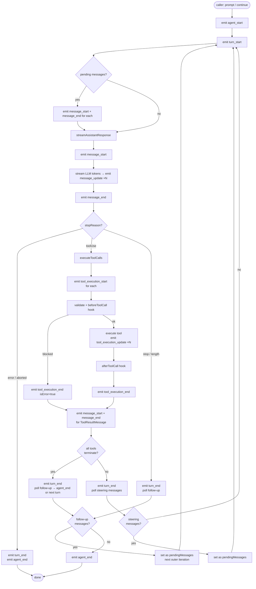

# Agent Loop

The agent loop is the engine that drives multi-turn LLM conversations. This document covers how the loop is structured, what state transitions it makes, and how tool execution interleaves with streaming.

See also: [code walkthrough](../c4-04-code-walkthrough.md), [tool execution](./tool-execution.md), [steering and follow-up](./steering-and-followup.md).

---

## State machine



---

## The two loops

The loop body in `runLoop` (the private shared function) has an **outer** loop and an **inner** loop.

### Inner loop

Condition: `hasMoreToolCalls || pendingMessages.length > 0`

Runs as long as:
1. The last assistant message had `stopReason: "toolUse"` **and** not all tools returned `terminate: true`, OR
2. There are pending steering messages to inject before the next LLM call.

Each inner loop iteration is one **turn**: one LLM call, optional tool execution, and one poll of the steering queue.

### Outer loop

Condition: runs `while (true)`, breaks when no follow-up messages arrive.

When the inner loop exits (no more tool calls, no pending messages), the loop polls `getFollowUpMessages`. If messages are returned they are set as `pendingMessages` and the outer loop runs another inner iteration. If no messages arrive, the outer loop breaks and `agent_end` is emitted.

---

## Streaming phase

`streamAssistantResponse` is called once per turn. It:

1. Runs `transformContext` (if configured) on the current `AgentMessage[]`.
2. Runs `convertToLlm` to produce a `Message[]` for the LLM.
3. Resolves the API key via `getApiKey` (or falls back to `config.apiKey`).
4. Calls `streamFn(model, llmContext, options)`.
5. Iterates over the returned `AssistantMessageEventStream`:

   | Stream event | Agent event emitted |
   |---|---|
   | `start` | `message_start` |
   | `text_start`, `text_delta`, `text_end` | `message_update` |
   | `thinking_start`, `thinking_delta`, `thinking_end` | `message_update` |
   | `toolcall_start`, `toolcall_delta`, `toolcall_end` | `message_update` |
   | `done` or `error` | `message_end` |

Every `message_update` carries the current partial `AssistantMessage` and the raw `AssistantMessageEvent` from `pi-ai`. UI code uses the `AssistantMessageEvent` to extract deltas; it uses the partial `AgentMessage` for full state snapshots.

---

## Tool execution phase

After `message_end` is emitted for an assistant message with `stopReason: "toolUse"`, `executeToolCalls` processes each tool call in the assistant message's `content` array.

The phase interleaves with the streaming phase: streaming is fully complete (all `message_update` events emitted, `message_end` emitted) before any tool starts. This is intentional — UI code can render the full assistant reasoning before showing tool progress.

For each tool call, the loop:

1. Emits `tool_execution_start`.
2. Runs `prepareToolCall`: resolves the tool by name, optionally calls `tool.prepareArguments`, validates with TypeBox, calls `beforeToolCall` hook.
3. If preparation succeeds: runs `executePreparedToolCall` (calls `tool.execute`, forwards `onUpdate` events as `tool_execution_update`).
4. Runs `finalizeExecutedToolCall`: calls `afterToolCall` hook, merges overrides.
5. Emits `tool_execution_end`.
6. Emits `message_start` + `message_end` for the `ToolResultMessage`.

See [tool execution](./tool-execution.md) for the parallel vs sequential distinction and hook details.

---

## Stop conditions

| `stopReason` | Loop action |
|---|---|
| `"toolUse"` | Execute tool calls, loop back for next LLM call (unless all tools returned `terminate: true`). |
| `"stop"` | Turn complete. Poll follow-up messages. If any: continue. Otherwise: `agent_end`. |
| `"length"` | Same as `"stop"`. The model hit `maxTokens`. Caller should check for truncation. |
| `"error"` | Emit `turn_end` (no tool results), emit `agent_end` immediately. No follow-up poll. |
| `"aborted"` | Same as `"error"`. The `AbortSignal` was triggered. |

The `terminate` flag on `AgentToolResult` adds an additional stop condition: if **every** tool result in a batch has `terminate: true`, the loop treats the turn as finished (equivalent to `stopReason: "stop"`) even though `stopReason` is `"toolUse"`. This lets a tool signal that the conversation should end without relying on the LLM to produce a natural stop.

---

## Low-level API: `agentLoop` and `agentLoopContinue`

These two exported functions wrap `runAgentLoop` / `runAgentLoopContinue` in an `EventStream<AgentEvent, AgentMessage[]>`:

```typescript
import { agentLoop } from "@mariozechner/pi-agent-core";

const stream = agentLoop([userMessage], context, config, signal, streamFn);

for await (const event of stream) {
  console.log(event.type);
}

const newMessages = await stream.result();
```

**Important difference from `Agent`:** In the low-level API, the `emit` callback pushes events into the stream buffer without `await`-ing the consumer. This means event handlers are NOT awaited before the loop moves to the next phase. Use the `Agent` class if you need the `message_end` barrier to be observed before tool execution starts.

---

## Error handling contract

The agent loop does not throw. All failures are encoded as `AgentEvent` values:

- Provider failures (network, auth, rate limit) produce an `AssistantMessage` with `stopReason: "error"` and `errorMessage`. The loop emits `turn_end` and `agent_end` immediately.
- Tool execution failures (thrown from `tool.execute`) are caught, converted to an error `ToolResultMessage` with `isError: true`, and fed back to the LLM. The loop continues.
- `convertToLlm` and `transformContext` must not throw. Throwing from either interrupts the loop without a normal event sequence. The `Agent` class catches this via `handleRunFailure`.
- Hook exceptions (`beforeToolCall`, `afterToolCall`) are caught and converted to error tool results.

---

## Timing and concurrency guarantees

- Only one `runAgentLoop` / `runAgentLoopContinue` call is active at a time within an `Agent`. `prompt()` throws if `activeRun` is set.
- Within a single turn, `emit` callbacks are awaited sequentially. The loop cannot advance to the next phase while a listener is pending. This is how `Agent.processEvents` provides the `message_end` barrier.
- Tool calls in parallel mode execute concurrently via `Promise.all`. Their `tool_execution_end` events are emitted in tool completion order. Tool result messages are emitted in assistant source order (the original tool call order), ensuring deterministic message IDs.
