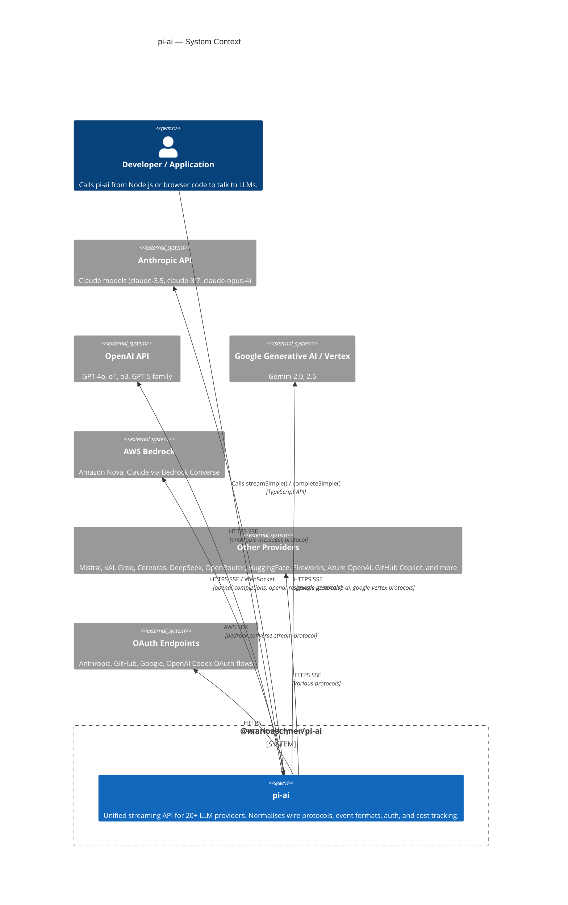

# C4 Level 1 — Context

This diagram answers the question: *what is `pi-ai` and who or what does it talk to?*

---

## Diagram

---

## Trust boundaries

| Boundary | Description |
|---|---|
| Application process | The calling code and `pi-ai` run in the same process. API keys may be passed directly or read from environment variables. |
| Provider network | All outbound traffic crosses the public internet over HTTPS. `pi-ai` never stores credentials beyond the lifetime of a request. |
| OAuth callback | During interactive login flows, pi-ai opens a local HTTP server on `127.0.0.1` to receive the OAuth redirect. No data leaves the machine during this step. |

---

## External dependencies

| Dependency | Auth mechanism |
|---|---|
| Anthropic | `ANTHROPIC_API_KEY` env var, `options.apiKey`, or OAuth token stored in `auth.json` |
| OpenAI | `OPENAI_API_KEY` env var or `options.apiKey` |
| Google Generative AI | `GEMINI_API_KEY` env var or `options.apiKey` |
| Google Vertex | `GOOGLE_CLOUD_API_KEY` env var or Application Default Credentials (`gcloud auth application-default login`) |
| AWS Bedrock | `AWS_ACCESS_KEY_ID` + `AWS_SECRET_ACCESS_KEY`, `AWS_PROFILE`, `AWS_BEARER_TOKEN_BEDROCK`, or IAM roles (ECS/IRSA) |
| GitHub Copilot | `COPILOT_GITHUB_TOKEN` / `GH_TOKEN` / `GITHUB_TOKEN` env var, or OAuth token |
| Azure OpenAI | `AZURE_OPENAI_API_KEY` env var |
| Mistral | `MISTRAL_API_KEY` env var |
| xAI | `XAI_API_KEY` env var |
| Groq | `GROQ_API_KEY` env var |
| Cerebras | `CEREBRAS_API_KEY` env var |
| OpenRouter | `OPENROUTER_API_KEY` env var |
| DeepSeek | `DEEPSEEK_API_KEY` env var |
| HuggingFace | `HF_TOKEN` env var |
| Fireworks | `FIREWORKS_API_KEY` env var |

---

## What pi-ai does NOT do

- No business logic, task planning, or agentic loop. See `packages/agent` for that.
- No conversation persistence. Messages must be supplied on every call.
- No tool execution. Tool calls are returned as structured data; the caller decides how to run them.
- No rate limiting or quota management. Errors from the provider are forwarded via the event stream.
- No response caching at the application level (though it does forward cache-control hints to providers that support prompt caching).

---

## Authentication summary

1. **API key via env var** — set `ANTHROPIC_API_KEY` (or provider equivalent) and pi-ai picks it up automatically via `getEnvApiKey()`. Source: `src/env-api-keys.ts`.
2. **API key via options** — pass `options.apiKey` to `streamSimple()`. Overrides the env var.
3. **OAuth** — for subscription accounts (GitHub Copilot, Anthropic Pro/Max, Gemini CLI, OpenAI Codex). Interactive login stores tokens in `auth.json` on disk. Token refresh is automatic. Source: `src/utils/oauth/`.
4. **AWS credential chain** — Bedrock delegates entirely to the AWS SDK credential resolution chain (IAM, profiles, container roles, etc.).

See [features/provider-auth.md](../features/provider-auth.md) for step-by-step details.
