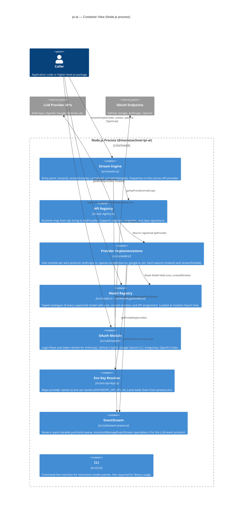
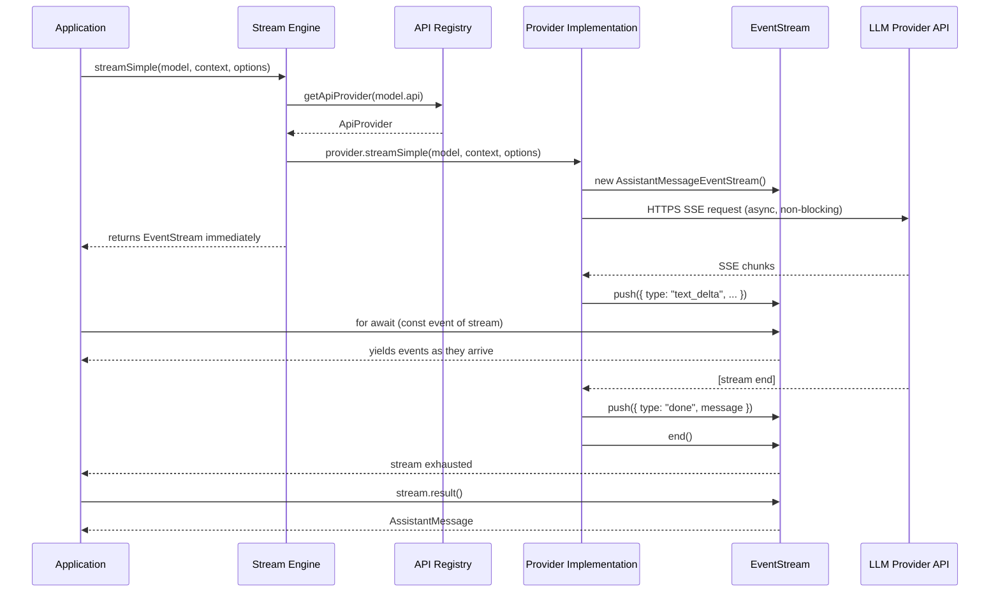

# C4 Level 2 — Container

This diagram zooms into the `@mariozechner/pi-ai` package and shows the major sub-systems (containers) that exist inside it at runtime.

---

## Diagram

---

## Runtime interaction sequence

---

## Container responsibilities

| Container | Source path | Responsibility |
|---|---|---|
| Stream Engine | `src/stream.ts` | Public entry points. Resolves provider, delegates, returns stream. |
| API Registry | `src/api-registry.ts` | Runtime map from `Api` string to `ApiProvider`. Supports dynamic registration. |
| Provider Implementations | `src/providers/*.ts` | Wire-protocol adapters. One per `KnownApi` value. Lazy-loaded on first use. |
| Model Registry | `src/models.ts` + `src/models.generated.ts` | Typed model catalogue. `getModel()`, `getModels()`, `calculateCost()`. |
| OAuth Module | `src/utils/oauth/` | PKCE login flows, token refresh, credential storage for subscription providers. |
| Env Key Resolver | `src/env-api-keys.ts` | Reads API keys from environment variables. Falls back to ambient credentials for Bedrock and Vertex. |
| EventStream | `src/utils/event-stream.ts` | Backpressure-safe async-iterable queue with a terminal result promise. |
| CLI | `src/cli.ts` | `pi-ai` binary for ad-hoc queries. Not used in library mode. |

---

## Browser compatibility

`pi-ai` is designed to work in modern browsers for providers that expose standard HTTPS APIs. Providers that rely on Node.js-only SDKs are **excluded from browser bundles**:

| Provider | Browser compatible? | Reason |
|---|---|---|
| Anthropic | Yes | Uses `fetch` + `@anthropic-ai/sdk` |
| OpenAI (completions / responses) | Yes | Uses `fetch` + `openai` SDK |
| Google Generative AI | Yes | Uses `fetch` + `@google/generative-ai` |
| Mistral | Yes | Uses `fetch` |
| AWS Bedrock | No | `@aws-sdk/client-bedrock-runtime` requires Node.js |
| Google Vertex | No | Requires `gcloud` ADC and Node.js filesystem |
| Google Gemini CLI | No | Requires filesystem OAuth token storage |

The lazy-loading architecture in `src/providers/register-builtins.ts` ensures that Node.js-only provider modules are never evaluated during browser bundle analysis.
