# C4 Level 3 — Component

This view zooms into the key modules inside `@mariozechner/pi-ai` and explains how they are structured and how they connect.

---

## Diagram

```mermaid
C4Component
  title pi-ai — Component View

  Container_Boundary(piAi, "@mariozechner/pi-ai") {

    Component(types, "types.ts", "Types", "All shared TypeScript types: Api, Model, Context, Message, AssistantMessageEvent, Usage, Tool, StopReason, ThinkingLevel, etc.")

    Component(streamTs, "stream.ts", "Entry Points", "stream(), streamSimple(), complete(), completeSimple(). Thin dispatch layer.")

    Component(apiRegistry, "api-registry.ts", "Registry", "Map<Api, ApiProvider>. registerApiProvider(), getApiProvider(), unregisterApiProviders().")

    Component(registerBuiltins, "providers/register-builtins.ts", "Bootstrap", "Registers all built-in providers at module load time using lazy wrappers. Exports setBedrockProviderModule() for injection.")

    Component(anthropic, "providers/anthropic.ts", "Provider", "anthropic-messages protocol. Uses @anthropic-ai/sdk. Handles streaming, tool calls, cache control, thinking blocks.")

    Component(openaiCompletions, "providers/openai-completions.ts", "Provider", "openai-completions protocol. Covers OpenAI, Groq, Cerebras, DeepSeek, xAI, Mistral-compat, OpenRouter, HuggingFace, Fireworks, and more.")

    Component(openaiResponses, "providers/openai-responses.ts", "Provider", "openai-responses protocol. Newer OpenAI Responses API with native reasoning support.")

    Component(google, "providers/google.ts", "Provider", "google-generative-ai protocol. Gemini models via @google/generative-ai SDK.")

    Component(bedrock, "providers/amazon-bedrock.ts", "Provider", "bedrock-converse-stream protocol. AWS SDK-based, Node.js only.")

    Component(mistral, "providers/mistral.ts", "Provider", "mistral-conversations protocol. Native Mistral API.")

    Component(simpleOptions, "providers/simple-options.ts", "Helper", "buildBaseOptions(), adjustMaxTokensForThinking(). Shared option conversion for all providers.")

    Component(transformMessages, "providers/transform-messages.ts", "Helper", "Normalises Message[] into provider-specific format. Handles thinking blocks, image content, tool results.")

    Component(eventStream, "utils/event-stream.ts", "Async Queue", "EventStream<T,R>: async-iterable push/end queue. AssistantMessageEventStream specialises it for AssistantMessageEvent / AssistantMessage.")

    Component(models, "models.ts", "Registry", "getModel(), getModels(), getProviders(), calculateCost(), supportsXhigh(), modelsAreEqual().")

    Component(modelsGenerated, "models.generated.ts", "Data", "Auto-generated catalogue of every known Model. Regenerated by scripts/generate-models.ts.")

    Component(envApiKeys, "env-api-keys.ts", "Auth", "getEnvApiKey(), findEnvKeys(). Maps provider name to env var. Handles Bedrock and Vertex ambient credentials.")

    Component(oauth, "utils/oauth/", "Auth", "PKCE OAuth flows for Anthropic, GitHub Copilot, Google Gemini CLI, Antigravity, OpenAI Codex.")
  }

  Rel(streamTs, apiRegistry, "getApiProvider(model.api)")
  Rel(apiRegistry, registerBuiltins, "populated by")
  Rel(registerBuiltins, anthropic, "lazy import")
  Rel(registerBuiltins, openaiCompletions, "lazy import")
  Rel(registerBuiltins, openaiResponses, "lazy import")
  Rel(registerBuiltins, google, "lazy import")
  Rel(registerBuiltins, bedrock, "lazy import")
  Rel(registerBuiltins, mistral, "lazy import")
  Rel(anthropic, eventStream, "push events")
  Rel(openaiCompletions, eventStream, "push events")
  Rel(google, eventStream, "push events")
  Rel(bedrock, eventStream, "push events")
  Rel(anthropic, simpleOptions, "buildBaseOptions()")
  Rel(openaiCompletions, simpleOptions, "buildBaseOptions()")
  Rel(anthropic, transformMessages, "transformMessages()")
  Rel(anthropic, envApiKeys, "getEnvApiKey()")
  Rel(models, modelsGenerated, "reads MODELS constant")
  Rel(streamTs, eventStream, "returns")
  Rel(types, streamTs, "imports")
  Rel(types, anthropic, "imports")
  Rel(types, openaiCompletions, "imports")
```

---

## Component table

| Module path | Responsibility |
|---|---|
| `src/types.ts` | Canonical type definitions for the entire package. All other modules import from here. |
| `src/stream.ts` | Public API entry points. Delegates to API registry. Side-effect: imports `register-builtins.ts`. |
| `src/api-registry.ts` | Runtime `Map<Api, ApiProvider>`. Supports dynamic registration, unregistration, and clearing. |
| `src/providers/register-builtins.ts` | Registers all built-in providers using lazy-load wrappers. Runs at module import time. |
| `src/providers/anthropic.ts` | Full Anthropic Messages streaming implementation: cache control, thinking blocks, tool streaming, GitHub Copilot stealth mode. |
| `src/providers/openai-completions.ts` | OpenAI Chat Completions streaming. Handles a large compat surface (`OpenAICompletionsCompat`) for the many providers that speak this protocol. |
| `src/providers/openai-responses.ts` | OpenAI Responses API. Newer protocol with native reasoning, background processing, and stateful sessions. |
| `src/providers/azure-openai-responses.ts` | Azure-specific wrapper around OpenAI Responses. |
| `src/providers/openai-codex-responses.ts` | OpenAI Codex (ChatGPT OAuth) via Responses API. |
| `src/providers/google.ts` | Google Generative AI (Gemini) streaming via `@google/generative-ai`. |
| `src/providers/google-vertex.ts` | Google Vertex AI streaming. Requires ADC credentials. |
| `src/providers/google-gemini-cli.ts` | Gemini via Google Cloud Code Assist OAuth. |
| `src/providers/amazon-bedrock.ts` | AWS Bedrock Converse streaming via `@aws-sdk/client-bedrock-runtime`. Node.js only. |
| `src/providers/mistral.ts` | Mistral Conversations API streaming. |
| `src/providers/simple-options.ts` | Converts `SimpleStreamOptions` into provider-specific `StreamOptions`. Computes thinking budgets. |
| `src/providers/transform-messages.ts` | Converts pi-ai `Message[]` into provider-specific request shapes. |
| `src/providers/github-copilot-headers.ts` | Builds Copilot-specific request headers and feature flags. |
| `src/providers/openai-responses-shared.ts` | Shared helpers for OpenAI Responses and Azure/Codex variants. |
| `src/providers/google-shared.ts` | Shared helpers for Google Generative AI and Vertex variants. |
| `src/providers/faux.ts` | In-memory fake provider used in tests. |
| `src/utils/event-stream.ts` | Generic `EventStream<T,R>` and `AssistantMessageEventStream`. The backbone of the streaming protocol. |
| `src/utils/hash.ts` | Lightweight hashing for cache keys and deduplication. |
| `src/utils/headers.ts` | Converts `Headers` objects to plain `Record<string, string>`. |
| `src/utils/json-parse.ts` | Streaming JSON parser with repair fallback for incomplete tool-call arguments. |
| `src/utils/overflow.ts` | Context window overflow detection helpers. |
| `src/utils/sanitize-unicode.ts` | Strips lone surrogates from model output to prevent downstream encoding errors. |
| `src/utils/typebox-helpers.ts` | TypeBox schema utilities for tool parameter validation. |
| `src/utils/validation.ts` | Runtime validation helpers. |
| `src/utils/oauth/` | PKCE OAuth 2.0 flows, token refresh, credential management. |
| `src/models.ts` | Model registry functions: `getModel`, `getModels`, `calculateCost`, `supportsXhigh`, `modelsAreEqual`. |
| `src/models.generated.ts` | Generated data file. Contains the `MODELS` constant with every known model definition. |
| `src/env-api-keys.ts` | Maps provider identifiers to environment variable names and reads API keys. |
| `src/oauth.ts` | Re-exports the OAuth module for convenient top-level import. |
| `src/cli.ts` | `pi-ai` CLI binary. |
| `src/index.ts` | Public package entry. Re-exports the public API surface. |

---

## Key components explained

### EventStream (`src/utils/event-stream.ts`)

`EventStream<T, R>` is a push-based async queue that also exposes a terminal result promise. Producers call `push(event)` to enqueue events and `end()` to signal completion. Consumers iterate with `for await (const event of stream)`. The `result()` method returns a `Promise<R>` that resolves when the terminal event (identified by the `isComplete` predicate) arrives.

`AssistantMessageEventStream` is a specialisation where `T = AssistantMessageEvent` and `R = AssistantMessage`. It considers `"done"` and `"error"` events as terminal and extracts the `AssistantMessage` from them.

### ApiRegistry (`src/api-registry.ts`)

The registry is a `Map<string, ApiProviderInternal>`. Providers are keyed by their `Api` string (`"anthropic-messages"`, `"openai-completions"`, etc.). Registration wraps the provider's `stream` and `streamSimple` functions with a type-safety guard that verifies `model.api` matches before delegating.

Built-in providers are registered lazily: `register-builtins.ts` registers wrapper functions that, on first call, dynamically import the real provider module and forward the call. This keeps startup cost low and makes the package browser-safe (Node.js-only providers are never imported in browser bundles).

### Provider implementations (`src/providers/*.ts`)

Each provider module exports two functions:

- `stream(model, context, options?)` — accepts provider-specific options (e.g., `AnthropicOptions` with `thinking.budget_tokens`).
- `streamSimple(model, context, options?)` — accepts the normalised `SimpleStreamOptions` and internally converts to provider-specific options using `buildBaseOptions()` and `adjustMaxTokensForThinking()`.

Both return an `AssistantMessageEventStream`. The implementation starts an HTTP request asynchronously, then pushes events into the stream as SSE chunks arrive.

### Model Registry (`src/models.ts` + `src/models.generated.ts`)

`MODELS` in `models.generated.ts` is a plain object keyed by provider then model ID. At module load time, `models.ts` reads this into a `Map<provider, Map<modelId, Model<Api>>>`. `getModel(provider, modelId)` is the primary lookup — TypeScript infers the correct `Api` type from the model ID, providing type-safe provider option access.

`calculateCost(model, usage)` multiplies raw token counts by the per-million-token rates stored on `Model.cost` and writes the results back into `usage.cost`.
