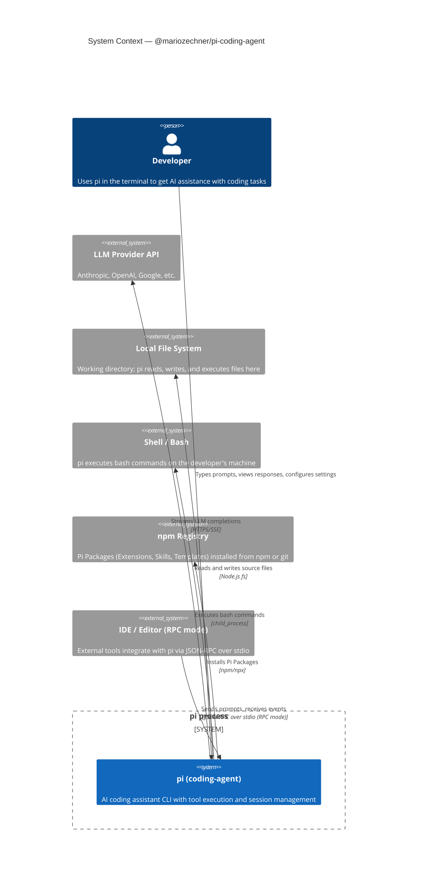

## Learning Objectives

- Identify who uses `pi` and what external systems it interacts with.
- Understand the trust boundary between the agent process and the local file system.
- Know which external services `pi` can reach and under what circumstances.

---

## C4 Context Diagram

---

## External Dependencies

| System | Role | Trust |
|--------|------|-------|
| LLM Provider API | Generates responses and tool calls | External; controlled via API key |
| Local File System | Source of truth for code context | Trusted; pi operates in the developer's working directory |
| Shell / Bash | Executes agent-requested commands | **High risk** — runs as the developer's user |
| npm Registry | Distributes Extensions and Skills | Semi-trusted; verify packages before installation |
| IDE (RPC mode) | Drives pi programmatically | Trusted process on localhost |

---

## Security Note

`pi` runs bash commands **as the user who launched it**, with no sandboxing by default. This is intentional for a developer tool. Be aware when running `pi` in CI or automated pipelines.

---

**Back to:** [README](./README.md) | [Container View →](./c4-02-container.md)
