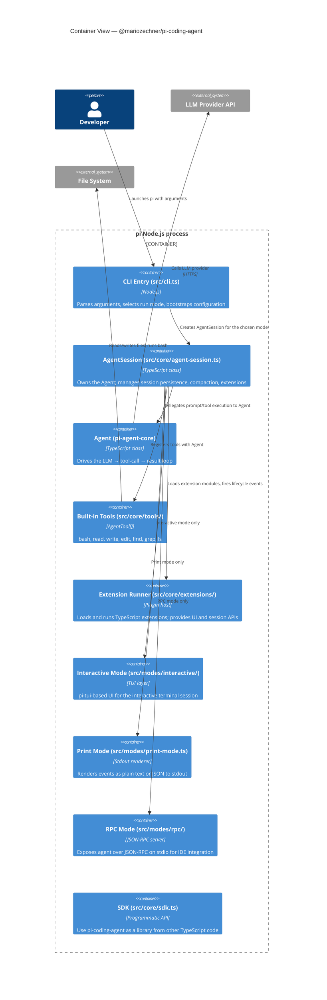

## Learning Objectives

- Identify the major runtime sub-systems inside the `pi` Node.js process.
- Understand how the four modes (interactive, print, RPC, SDK) share the same `AgentSession` core.
- See how extensions and skills are loaded at startup.

---

## C4 Container Diagram

---

## Mode Comparison

| Mode | Entry | I/O | Use Case |
|------|-------|-----|----------|
| Interactive | `pi` (no flags) | pi-tui terminal UI | Daily coding assistant |
| Print/JSON | `pi --print` | stdout text or JSON | Shell scripts, CI |
| RPC | `pi --rpc` | JSON-RPC over stdio | IDE/editor integration |
| SDK | `import { AgentSession }` | Programmatic TypeScript | Embed in other tools |

---

**← [Context](./c4-01-context.md)** | **[Component View →](./c4-03-component.md)**
