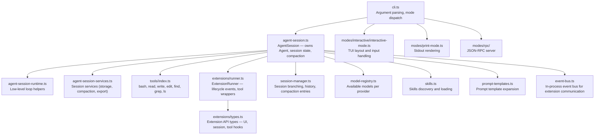

## Learning Objectives

- Map the key source modules of `pi-coding-agent` to their responsibilities.
- Understand the role of `AgentSession` as the shared core across all modes.
- Identify the extension system's lifecycle hooks.

---

## C4 Component Diagram

---

## Key Module Responsibilities

| Module | Path | Responsibility |
|--------|------|---------------|
| `AgentSession` | `src/core/agent-session.ts` | Core abstraction: owns Agent, drives the run, handles compaction and session save |
| `ExtensionRunner` | `src/core/extensions/runner.ts` | Loads extension modules, fires lifecycle hooks (session_start, turn_end, tool_execution_end, …) |
| `SessionManager` | `src/core/session-manager.ts` | Manages named sessions, branches, compaction history on disk |
| `ToolDefinitionWrapper` | `src/core/tools/tool-definition-wrapper.ts` | Wraps tool execute() with extension beforeTool/afterTool hooks |
| `skills.ts` | `src/core/skills.ts` | Discovers and loads Skill markdown files; formats them into the system prompt |
| `prompt-templates.ts` | `src/core/prompt-templates.ts` | Expands `{{variable}}` tokens in prompt templates |
| `event-bus.ts` | `src/core/event-bus.ts` | In-process pub/sub for decoupled extension ↔ core communication |
| `model-registry.ts` | `src/core/model-registry.ts` | Presents models from pi-ai filtered by provider settings |
| `bash-executor.ts` | `src/core/bash-executor.ts` | Runs bash commands; captures stdout/stderr; enforces timeouts |
| `compaction/` | `src/core/compaction/` | Summarizes old messages to keep context window manageable |

---

**← [Container](./c4-02-container.md)** | **[Code Walkthrough →](./c4-04-code-walkthrough.md)**
