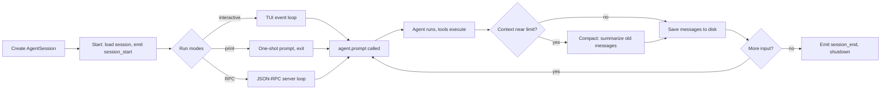

# Feature: AgentSession Lifecycle

## Learning Objectives

- Understand what `AgentSession` adds on top of the bare `Agent` class.
- Trace the full lifecycle: startup → runs → compaction → shutdown.
- Know how to use `AgentSession` from the SDK.

---

## Background

`AgentSession` (`src/core/agent-session.ts`) is the central abstraction that all pi run modes use. It:

1. Creates and owns the `Agent` instance.
2. Wires up session persistence (saving messages to disk between runs).
3. Manages context compaction when the context window fills up.
4. Fires extension lifecycle hooks at each phase.
5. Provides session branching (save a named "snapshot" of the conversation).

---

## Lifecycle Phases



---

## Context Compaction

When the estimated token count exceeds a threshold, `AgentSession` compacts the context:

```typescript
// src/core/agent-session.ts (simplified)
if (await shouldCompact(agent.state.messages, model)) {
  const summary = await compact(agent, compactionConfig);
  agent.state.messages = summary.compactedMessages;
}
```

Compaction calls the LLM to summarize old messages into a single `CompactionEntry`. The original messages are preserved on disk; the live context shrinks.

---

## Session Branching

Branch at any point to create a named fork of the conversation:

```typescript
// SDK usage
const session = await createAgentSession({ workingDir });
await session.prompt("Refactor the auth module.");
// Save a named branch before taking a risky action
await session.createBranch("before-risky-refactor");
await session.prompt("Delete all deprecated auth helpers.");
// If the outcome is bad, revert to the branch
await session.switchToBranch("before-risky-refactor");
```

---

## SDK Usage

```typescript
import { createAgentSession } from "@mariozechner/pi-coding-agent";

const session = await createAgentSession({
  workingDir: process.cwd(),
  provider: "anthropic",
  model: "claude-sonnet-4-5",
});

for await (const event of session.promptStream("Explain this codebase.")) {
  if (event.type === "message_update") {
    process.stdout.write(event.message.content.map(c => c.type === "text" ? c.text : "").join(""));
  }
}
```

---

## Check-Yourself Questions

1. What three things does `AgentSession` add on top of `Agent`?
2. When does context compaction trigger?
3. What is the purpose of session branching?
4. Which lifecycle event do extensions listen to at session startup?
5. How does the SDK mode differ from interactive mode in terms of I/O?
