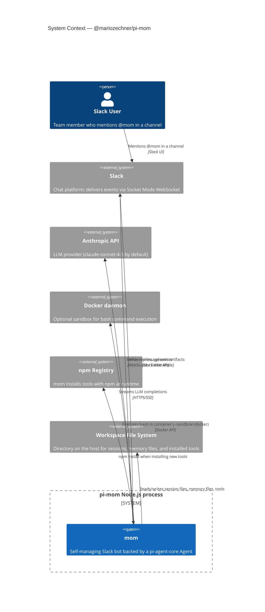

## C4 Context Diagram

---

## External Dependencies

| System | Role | Trust |
|--------|------|-------|
| Slack | Event delivery and reply sending | External; authenticated via bot/app tokens |
| Anthropic API | LLM inference | External; authenticated via API key |
| Docker daemon | Bash sandbox | Local; requires Docker socket access |
| npm Registry | Tool installation at runtime | Semi-trusted; mom can `npm install` arbitrary packages |
| Workspace FS | Persistence | Trusted; operator-controlled directory |

---

## Security Considerations

Running mom with `--sandbox=host` (the default) gives the agent **unrestricted bash access on the host machine**. Use `--sandbox=docker` in production or shared environments to isolate execution.

---

**Back to:** [README](./README.md) | [Container View →](./c4-02-container.md)
