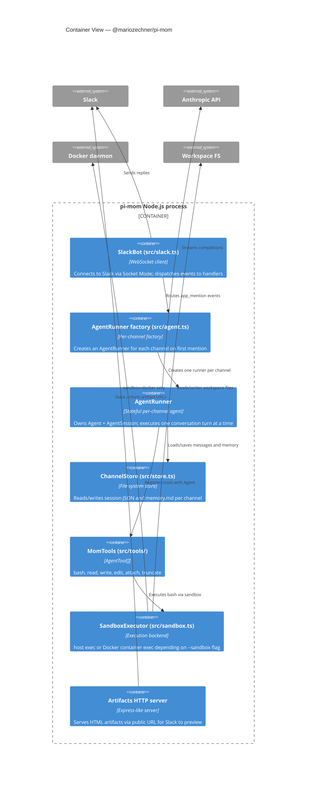

## C4 Container Diagram

---

## Key Runtime Facts

- **One `AgentRunner` per channel.** Channels are isolated; a conversation in `#engineering` cannot see `#marketing` history.
- **Sequential per-channel processing.** If a second mention arrives while the agent is running, mom queues it and processes it after the current run completes.
- **Persistent workspace.** All files written during a session survive process restarts.

---

**← [Context](./c4-01-context.md)** | **[Component View →](./c4-03-component.md)**
