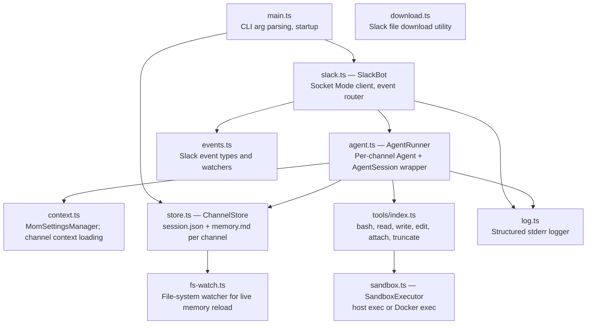

## C4 Component Diagram

---

## Component Responsibilities

| Module | Responsibility |
|--------|---------------|
| `main.ts` | Parse CLI args, validate env vars, start SlackBot |
| `slack.ts` | Maintain WebSocket connection to Slack; dispatch `app_mention` events to `AgentRunner` |
| `agent.ts` | Create `Agent` + `AgentSession`; inject memory file into system prompt; call `agent.prompt()` |
| `context.ts` | Build `SettingsManager` for mom; load channel-specific context (memory, history) |
| `store.ts` | Read/write `workspace/{channelId}/session.json` and `memory.md` |
| `tools/` | bash, read, write, edit, attach (uploads file to Slack), truncate |
| `sandbox.ts` | Execute bash commands either directly or via `docker exec` |
| `log.ts` | Structured JSON logging to stderr |
| `fs-watch.ts` | Watch memory.md for external edits; reload automatically |

---

**← [Container](./c4-02-container.md)** | **[Code Walkthrough →](./c4-04-code-walkthrough.md)**
