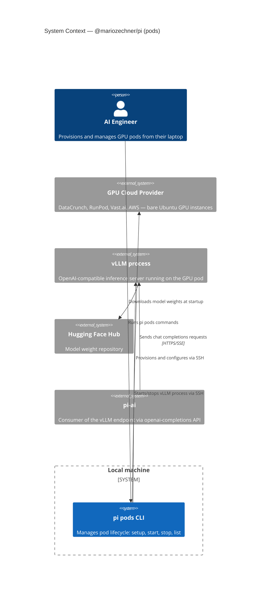

## C4 Context Diagram

---

## External Dependencies

| System | Role | Notes |
|--------|------|-------|
| GPU Cloud Provider | Provides the hardware | Any provider that gives you root SSH access to a GPU instance |
| vLLM | Inference server | Installed by `pi pods setup`; serves OpenAI-compatible `/v1/chat/completions` |
| Hugging Face Hub | Model weights | `HF_TOKEN` must be set for gated models |
| pi-ai | Consumes the endpoint | Uses `openai-completions` API with a custom `baseUrl` |

---

## Trust Boundaries

- SSH private key grants root access to the GPU pod. Protect it accordingly.
- `PI_API_KEY` is the secret that protects the vLLM endpoint. Set it in the environment before running `pi pods setup`.
- The vLLM endpoint is exposed on a public IP (or via SSH tunnel). Consider firewall rules.

---

**Back to:** [README](./README.md) | [Container View →](./c4-02-container.md)
