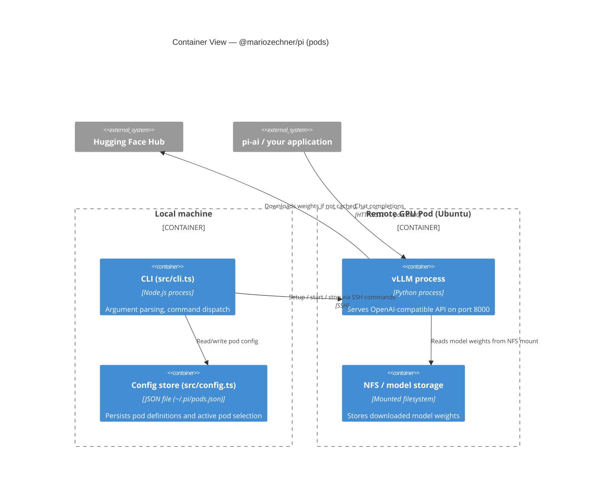

## C4 Container Diagram



---

## Config File (`~/.pi/pods.json`)

`pi pods` persists all pod definitions locally:

```json
{
  "active": "my-pod",
  "pods": {
    "my-pod": {
      "ssh": "ssh user@203.0.113.10",
      "gpus": [{ "name": "NVIDIA H100", "count": 2 }],
      "vllmVersion": "release",
      "modelsPath": "/mnt/models"
    }
  }
}
```

---

**← [Context](./c4-01-context.md)** | **[Component View →](./c4-03-component.md)**
