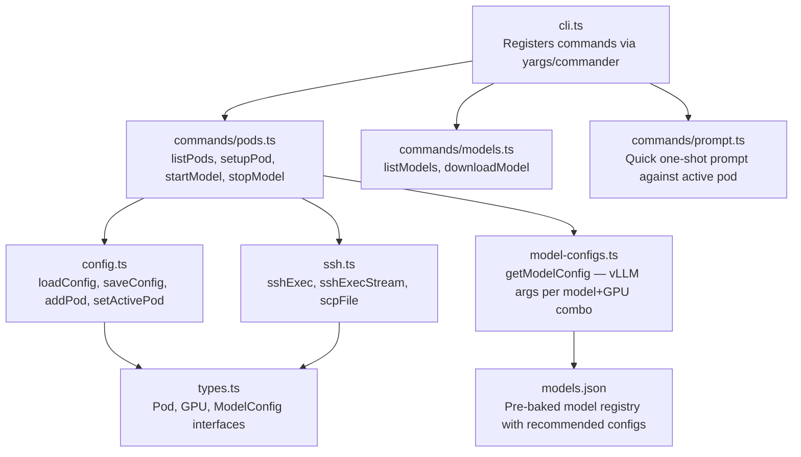

## C4 Component Diagram

---

## Component Responsibilities

| Module | Responsibility |
|--------|---------------|
| `cli.ts` | Parse `pi pods/models/prompt` subcommands |
| `commands/pods.ts` | `setup`, `start`, `stop`, `list` pod operations |
| `commands/models.ts` | List and download models on the remote pod |
| `commands/prompt.ts` | Send a single prompt to the active pod and print the response |
| `config.ts` | Read/write `~/.pi/pods.json`; manage active pod selection |
| `ssh.ts` | Execute commands on remote pods via SSH; stream output; SCP files |
| `model-configs.ts` | Look up the optimal vLLM CLI args for a model + GPU combination |
| `models.json` | Static registry: model IDs → recommended GPU counts, vLLM args, tool parsers |
| `types.ts` | `Pod`, `GPU`, `ModelConfig`, `PodConfig` interfaces |

---

**← [Container](./c4-02-container.md)** | **[Code Walkthrough →](./c4-04-code-walkthrough.md)**
