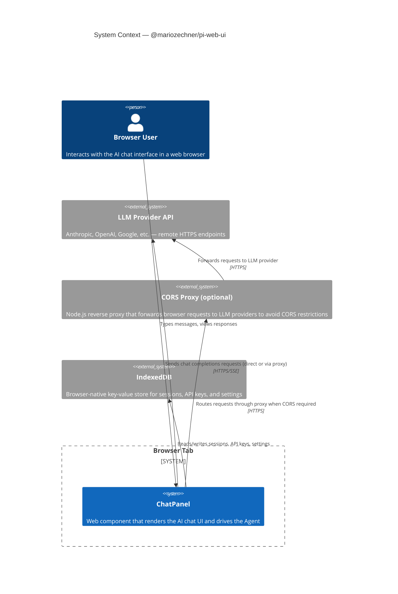

## Learning Objectives

After this lesson you will be able to:

- Describe the external actors and systems that `pi-web-ui` interacts with.
- Identify the trust boundaries between the browser, the LLM provider, and a CORS proxy.
- Explain why a proxy server is optional but recommended for production deployments.

---

## C4 Context Diagram

---

## External Dependencies

| System | Role | Notes |
|--------|------|-------|
| LLM Provider API | Generates assistant responses | One of 20+ providers via `pi-ai` |
| IndexedDB | Session and credential storage | Built into every modern browser; no server needed |
| CORS Proxy | Bridges browser CORS restrictions | Optional; ship `@mariozechner/pi-agent-core`'s proxy server or BYO |
| File System (File API) | User-uploaded attachments | Browser File API; no server upload required |

---

## Trust Boundaries

**Browser sandbox** — All JavaScript runs inside the browser's security sandbox. API keys stored in IndexedDB are accessible to any script on the same origin.

**Iframe artifact sandbox** — Tool-generated HTML/JS artifacts execute in a sandboxed `<iframe>` with `sandbox="allow-scripts"` but no `allow-same-origin`, isolating them from the parent page's DOM and credentials.

**CORS boundary** — Most LLM providers return `Access-Control-Allow-Origin: *` only for specific routes or not at all. The optional proxy solves this without exposing your API key in client-side code.

---

## What pi-web-ui Does NOT Do

- **No server-side processing** — purely a browser library; bring your own backend if needed.
- **No built-in authentication gateway** — API keys are stored client-side; for multi-user apps you need a backend proxy that injects keys server-side.
- **No file storage** — uploaded files exist only in memory during the session unless you implement a custom storage backend.

---

**Back to:** [README](./README.md) | [Container View →](./c4-02-container.md)
