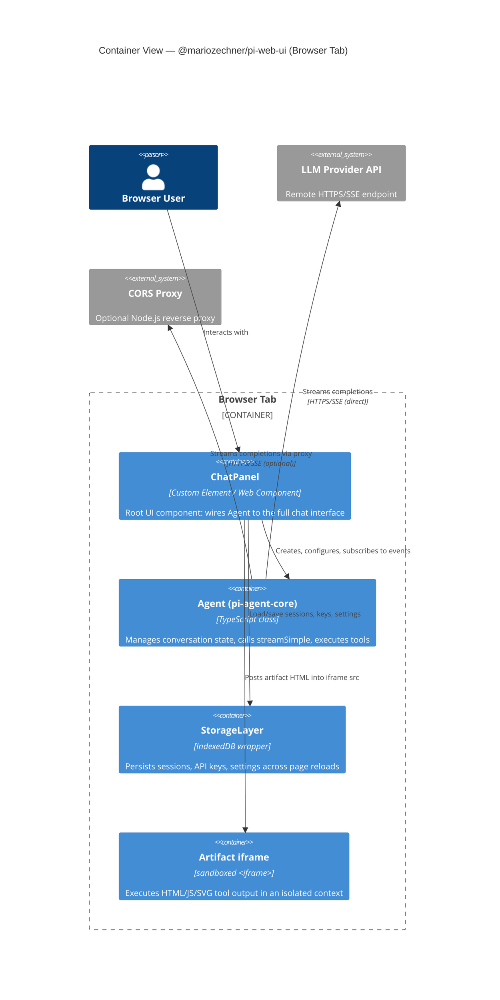

## Learning Objectives

- Identify the major runtime containers inside a browser tab running `pi-web-ui`.
- Understand how the `Agent` (pi-agent-core) lives entirely in the browser's main thread.
- Explain how the sandboxed artifact iframe is isolated from the host page.

---

## C4 Container Diagram

---

## Container Descriptions

### ChatPanel (`src/ChatPanel.ts`)
The top-level custom element (`<pi-chat-panel>`). Responsibilities:
- Instantiate and own the `Agent` instance (or accept one via the `agent` property).
- Render the message list, streaming message bubble, tool-call cards, and artifacts panel.
- Forward user input to `agent.prompt()`.
- Subscribe to `AgentEvent`s and re-render the UI accordingly.

### Agent (pi-agent-core)
Lives in the **browser main thread** — there is no Worker or shared process. This is fine for chat latency; if you need background processing, move to a Web Worker (requires serializing events across the MessageChannel boundary).

### StorageLayer (`src/storage/`)
Wraps IndexedDB via a thin async API. Three stores:
- **sessions** — serialized `AgentMessage[]` arrays, one entry per session.
- **apiKeys** — provider → API key map.
- **settings** — UI preferences (theme, model selection).

### Artifact iframe (`src/components/SandboxedIframe.ts`)
Receives `srcdoc` blobs from tool results. The `sandbox` attribute is set to `allow-scripts` only. This means:
- Scripts run, but no `localStorage`, `IndexedDB`, `fetch` to same-origin, or DOM access to the parent.
- Safe for AI-generated HTML visualizations and charts.

---

## CORS Proxy (optional)

When `chatpanel.useProxy = true`, the Agent is configured with a `baseUrl` override pointing at a local Node.js proxy server (provided by `@mariozechner/pi-agent-core`). The proxy forwards requests with the real API key injected server-side, preventing key exposure in browser network traffic.

---

**← [Context](./c4-01-context.md)** | **[Component View →](./c4-03-component.md)**
