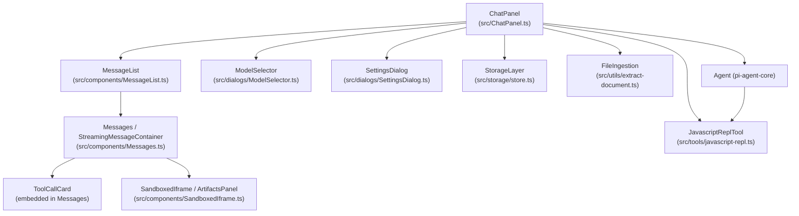

## Learning Objectives

- Map the key TypeScript modules in `pi-web-ui` to their responsibilities.
- Understand how `ChatPanel` composes sub-components to build the full chat UI.
- Identify where file ingestion, artifact rendering, and storage fit in the component graph.

---

## C4 Component Diagram

---

## Component Responsibilities

| Module | Path | Responsibility |
|--------|------|---------------|
| `ChatPanel` | `src/ChatPanel.ts` | Root custom element; owns Agent, wires everything together |
| `MessageList` | `src/components/MessageList.ts` | Scrollable list of rendered messages |
| `Messages` | `src/components/Messages.ts` | Renders individual user/assistant/tool-result messages |
| `StreamingMessageContainer` | `src/components/StreamingMessageContainer.ts` | Live-updating bubble for in-progress responses |
| `ThinkingBlock` | `src/components/ThinkingBlock.ts` | Collapsible display for chain-of-thought thinking |
| `SandboxedIframe` | `src/components/SandboxedIframe.ts` | Isolated iframe for artifact HTML/JS/SVG output |
| `ModelSelector` | `src/dialogs/ModelSelector.ts` | Provider + model picker dialog |
| `SettingsDialog` | `src/dialogs/SettingsDialog.ts` | Tabbed settings panel (providers, models, UI) |
| `SessionListDialog` | `src/dialogs/SessionListDialog.ts` | Browse and restore past sessions |
| `ApiKeyPromptDialog` | `src/dialogs/ApiKeyPromptDialog.ts` | First-run API key entry |
| `StorageLayer` | `src/storage/store.ts` | IndexedDB read/write facade |
| `FileIngestion` | `src/utils/extract-document.ts` | PDF/DOCX/XLSX/PPTX → text or image extraction |
| `JavascriptReplTool` | `src/tools/javascript-repl.ts` | LLM-callable JS REPL that produces artifacts |
| `AgentInterface` | `src/components/AgentInterface.ts` | Input bar, send button, attachment picker |

---

## Key Interaction Flows

**Message send:**
`AgentInterface` → `ChatPanel.submit()` → `agent.prompt()` → streaming events → `MessageList` re-render

**File attachment:**
User picks file → `FileIngestion` extracts content → content injected into user message as `ImageContent` or `TextContent`

**Artifact rendering:**
`JavascriptReplTool.execute()` returns HTML string → `ChatPanel` posts it to `SandboxedIframe.srcdoc`

---

**← [Container](./c4-02-container.md)** | **[Code Walkthrough →](./c4-04-code-walkthrough.md)**
