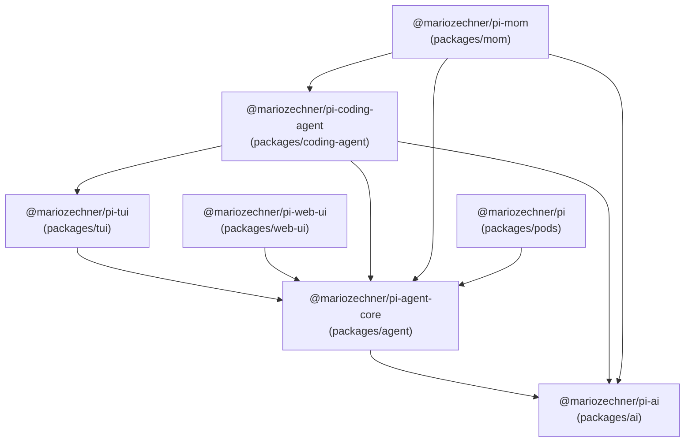
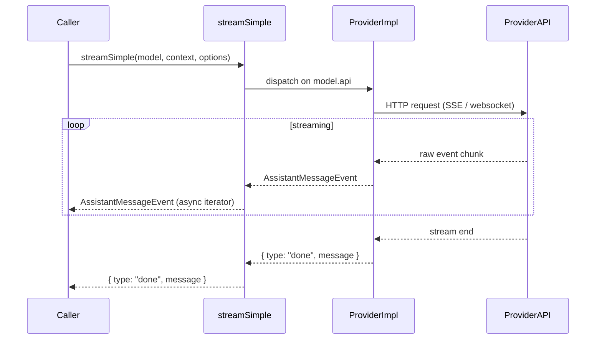
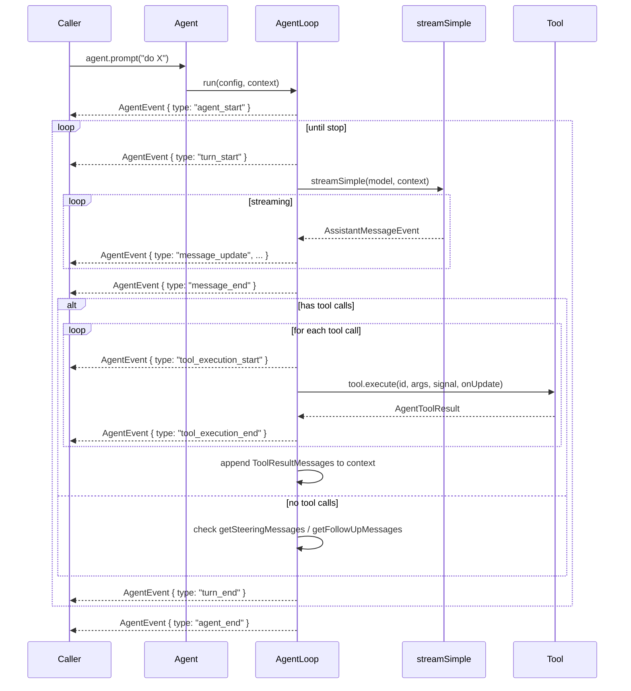
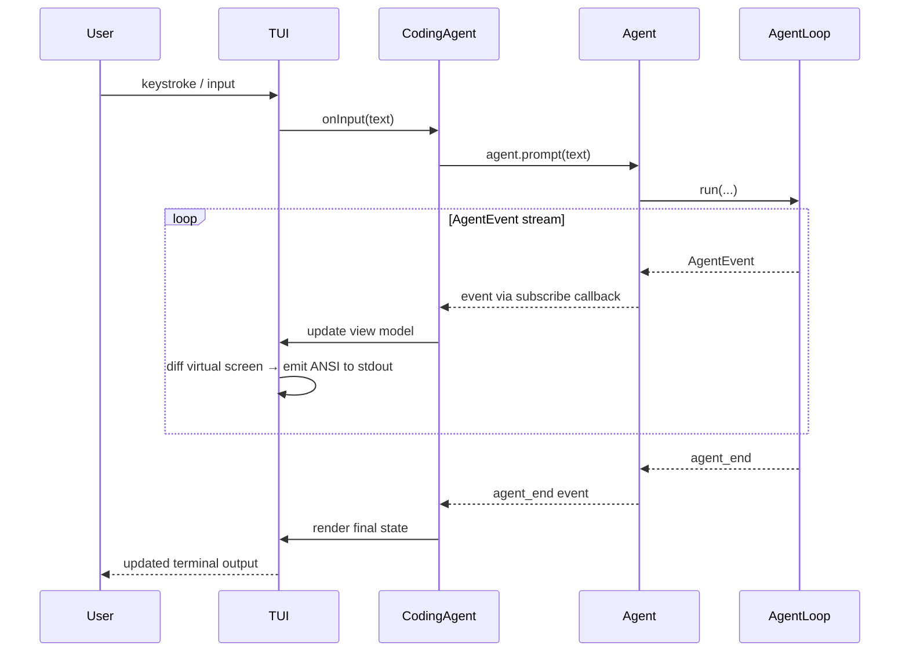
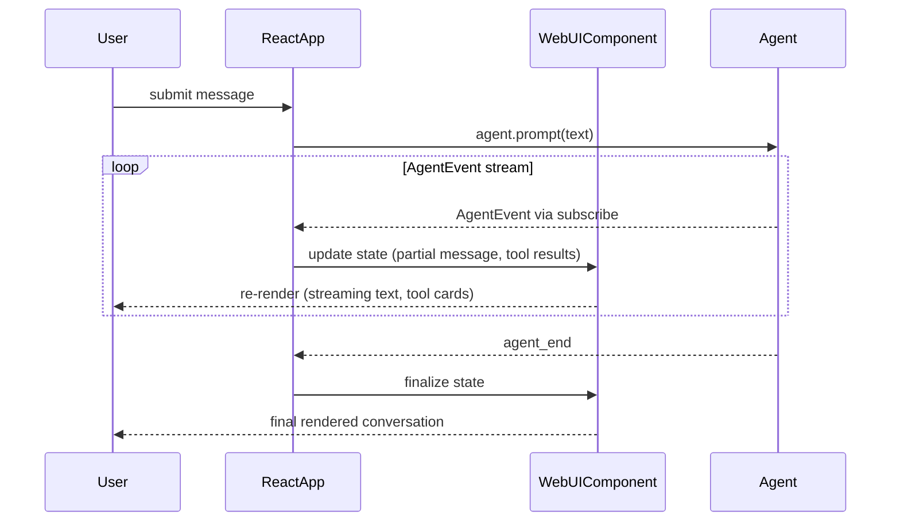
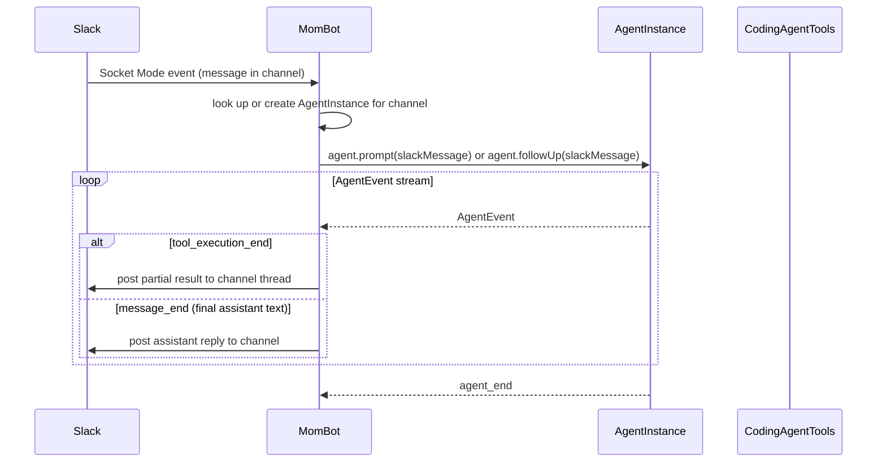
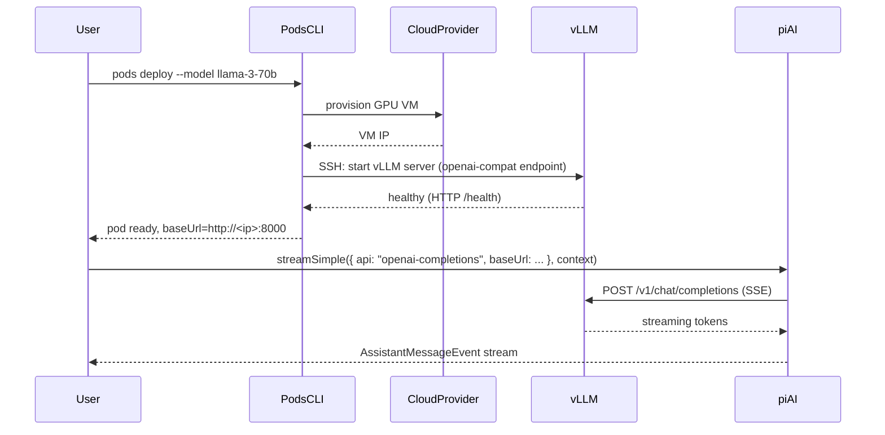

# Architecture Overview

**Learning objectives.** After reading this document you should be able to:

- Describe the four-layer model of pi-mono and explain why the layers are ordered the way they are.
- Trace data and control flow end-to-end for six representative runtime scenarios.
- Identify which package owns each cross-cutting concern (auth, persistence, telemetry).
- Explain the dependency inversion that prevents the UI layer from coupling to specific LLM providers.

---

## 1. Layered Architecture

pi-mono is built in four layers. Higher layers depend on lower layers; lower layers know nothing about higher layers.

```
┌─────────────────────────────────────────────────────────────────┐
│  Layer 4 — Applications                                         │
│  packages/coding-agent   packages/mom   packages/pods           │
├─────────────────────────────────────────────────────────────────┤
│  Layer 3 — UI                                                   │
│  packages/tui            packages/web-ui                        │
├─────────────────────────────────────────────────────────────────┤
│  Layer 2 — Core Agent                                           │
│  packages/agent                                                 │
├─────────────────────────────────────────────────────────────────┤
│  Layer 1 — Foundation                                           │
│  packages/ai                                                    │
└─────────────────────────────────────────────────────────────────┘
```

**Layer 1 — Foundation (`packages/ai`).** The only package with zero internal dependencies. It wraps provider SDKs (Anthropic, OpenAI, Google, AWS Bedrock, Mistral, and 15 others) behind a single `StreamFunction` contract. Everything above this layer calls `streamSimple` and never imports a provider SDK directly.

**Layer 2 — Core Agent (`packages/agent`).** Implements the stateful agent loop on top of `streamSimple`. Provides the `Agent` class, `AgentLoopConfig` extension points, and the `AgentEvent` stream. This layer has no knowledge of terminals, browsers, or Slack.

**Layer 3 — UI (`packages/tui`, `packages/web-ui`).** Terminal and browser rendering layers. Both depend on `packages/agent` for event subscriptions; neither knows which LLM provider is in use. `packages/tui` additionally provides a reusable editor, autocomplete, overlays, and Markdown renderer. `packages/web-ui` exports React components for browser-based chat.

**Layer 4 — Applications (`packages/coding-agent`, `packages/mom`, `packages/pods`).** End-user products. `coding-agent` composes all three lower layers into the `pi` CLI. `mom` builds a Slack bot using the agent and coding-agent layers. `pods` uses the agent layer for its management CLI and orchestrates GPU infrastructure via vLLM.

---

## 2. Dependency Graph



The absence of any edge pointing back toward `ai` from an application package is intentional — it enforces that all LLM calls go through the `streamSimple` abstraction and prevents provider lock-in at the application layer.

---

## 3. Runtime Flows

### Flow 1: Simple LLM Call (`packages/ai`)

The simplest possible usage: call a model and stream the response.



Key points:
- `streamSimple` dispatches to the correct provider implementation using `model.api`.
- All provider-specific event formats (SSE chunks, SDK callbacks) are translated into the `AssistantMessageEvent` union before leaving the provider module.
- The caller receives a single async iterator regardless of provider.
- Errors are encoded as `{ type: "error" }` events, not exceptions.

### Flow 2: Agent Loop (`packages/agent`)

A full agentic turn: prompt → LLM → tool calls → loop.



Key points:
- The caller subscribes to `AgentEvent` via `agent.subscribe(handler)` before calling `agent.prompt()`.
- The loop is entirely event-driven; the caller never awaits individual turns.
- Tool execution mode (`"parallel"` or `"sequential"`) is configured in `AgentLoopConfig.toolExecution`.
- `beforeToolCall` and `afterToolCall` hooks are invoked synchronously within the loop, surrounding each `tool.execute()` call.

### Flow 3: Interactive TUI Session (`packages/coding-agent` + `packages/tui`)

How the `pi` CLI renders an interactive coding session.



Key points:
- `pi-tui` owns the terminal lifecycle (raw mode, resize events, input buffering). The coding agent never writes directly to `stdout`.
- TUI rendering is diff-based: the framework computes the delta between the previous and current virtual screen and emits only the changed cells, eliminating flicker.
- Tool execution results (bash output, file writes) flow back through `AgentEvent { type: "tool_execution_end" }` and are rendered as collapsible tool-result cards in the TUI.

### Flow 4: Browser Chat (`packages/web-ui`)

How a browser client renders an agent conversation.



Key points:
- `packages/web-ui` exports React components that accept `AgentEvent` values as props or via context, not raw LLM events.
- The component library handles partial-message rendering (streaming text with a cursor), collapsible thinking blocks, and tool-result cards.
- The agent instance itself runs in the same browser process; there is no mandatory server-side component for chat-only use cases.

### Flow 5: Slack Bot Event Handling (`packages/mom`)

How the `mom` Slack bot processes a message.



Key points:
- `mom` maintains one `Agent` instance per Slack channel, preserving conversation history across messages.
- While an agent is running, additional messages are queued and delivered via `getFollowUpMessages` so the agent processes them in-order without concurrent runs.
- `mom` can install new tools into a running agent instance (self-extension), using the skill mechanism from `packages/coding-agent`.
- Slack message threading maps 1:1 to agent turns; each turn's tool results are posted as thread replies.

### Flow 6: Self-Hosted LLM on GPU Pod (`packages/pods`)

How pods provisions a model and routes inference requests.



Key points:
- vLLM exposes an OpenAI-compatible HTTP API, so `api: "openai-completions"` in `pi-ai` works without any provider-specific code.
- The pod's `baseUrl` is the only configuration change needed to switch from a cloud LLM to a self-hosted one.
- `packages/pods` uses the `packages/agent` event infrastructure for its own management CLI prompts.

---

## 4. Package Responsibility Matrix

| Concern | `ai` | `agent` | `tui` | `web-ui` | `coding-agent` | `mom` | `pods` |
|---------|------|---------|-------|----------|----------------|-------|--------|
| LLM wire protocol | ✓ | | | | | | |
| Model catalogue | ✓ | | | | | | |
| Token counting / cost | ✓ | | | | | | |
| Agent loop | | ✓ | | | | | |
| Tool execution | | ✓ | | | | | |
| Event streaming | | ✓ | | | | | |
| Terminal rendering | | | ✓ | | | | |
| Input handling (keyboard) | | | ✓ | | | | |
| Browser rendering | | | | ✓ | | | |
| Bash / file system tools | | | | | ✓ | | |
| Interactive coding session | | | | | ✓ | | |
| Slack integration | | | | | | ✓ | |
| Self-extension (tool install) | | | | | ✓ | ✓ | |
| GPU pod lifecycle | | | | | | | ✓ |
| vLLM deployment | | | | | | | ✓ |

---

## 5. Cross-Cutting Concerns

### Authentication

Authentication is handled in `packages/ai` via `StreamOptions.apiKey` (passed per-call) and `StreamOptions.getApiKey` (dynamic resolver). The agent layer surfaces `AgentLoopConfig.getApiKey`, which is called before each LLM request. OAuth flows (e.g., GitHub Copilot) are implemented in `packages/ai/src/providers/` and produce short-lived tokens that `getApiKey` refreshes transparently.

There is no global auth singleton. Credentials are always injected at the call site, which makes it straightforward to run multiple agents with different credentials in the same process.

### Telemetry

There is no built-in telemetry SDK dependency. Observability is implemented by subscribing to `AgentEvent` values and routing them to the logging/tracing system of your choice. See `reference/observability.md` for the full taxonomy and recommended schema.

### Persistence

`packages/agent` does not persist conversation history. Persistence is the responsibility of the application layer. `packages/coding-agent` saves and loads sessions from disk. `packages/mom` keeps conversations in memory for the lifetime of the bot process and does not currently persist across restarts. If you need durable sessions, serialize `agent.state.messages` and restore it by assigning to `agent.state.messages` before the next `agent.prompt()` call.

### Error Handling

All errors at the LLM layer are encoded as `AssistantMessageEvent { type: "error" }` and surfaced as `AgentEvent { type: "message_end", message }` where `message.stopReason === "error"`. The agent loop never lets an LLM error propagate as an unhandled exception. Tool errors thrown by `tool.execute()` are caught, converted to `ToolResultMessage` with `isError: true`, and the loop continues. Only errors in extension-point callbacks (if they violate the "must not throw" contract) will escape the loop.
