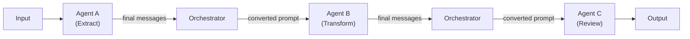
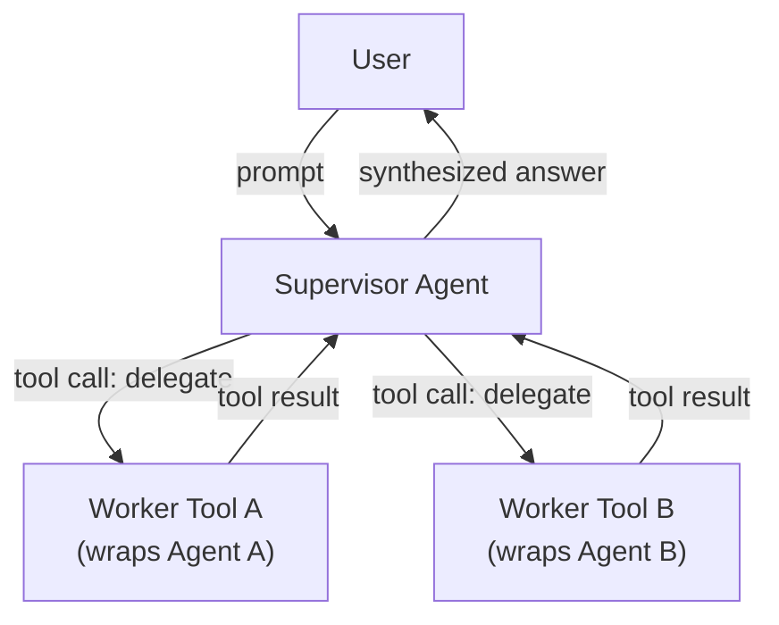
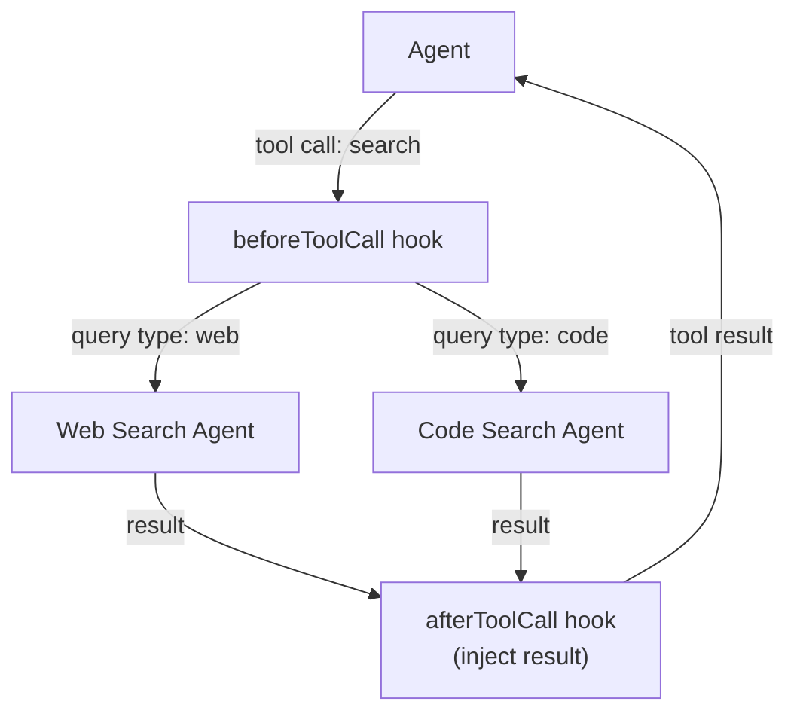
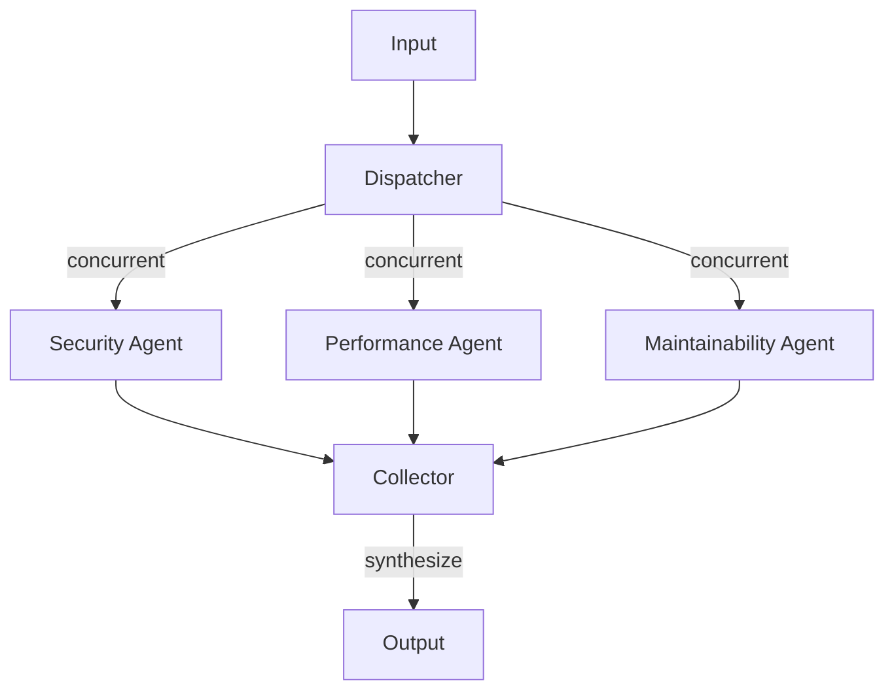

# Multi-Agent Orchestration

**Learning objectives.** After reading this document you should be able to:

- Define multi-agent orchestration and explain when a single agent is insufficient.
- Implement the four canonical orchestration patterns using the `Agent` class and `AgentLoopConfig`.
- Use `getSteeringMessages` and `getFollowUpMessages` to coordinate agents without coupling them.
- Use `beforeToolCall` and `afterToolCall` hooks to route tool calls to specialized agents.
- Reason about state isolation, context hand-off, and failure handling across agent boundaries.

---

## 1. What Multi-Agent Orchestration Means in This Codebase

A single `Agent` instance runs one conversation thread: one system prompt, one message history, one model, one set of tools. Multi-agent orchestration is the practice of running several `Agent` instances — potentially with different models, system prompts, and tool sets — and connecting them so that the output of one agent influences the input of another.

In pi-mono, orchestration is built from three primitives:

1. **The `Agent` class** (`packages/agent`) — stateful wrapper around the agent loop. Exposes `prompt()`, `steer()`, `followUp()`, `abort()`, and `subscribe()`.
2. **`AgentLoopConfig` callbacks** — `getSteeringMessages`, `getFollowUpMessages`, `beforeToolCall`, `afterToolCall`. These are the intended extension points for orchestration logic.
3. **Tool calls** — agents can call other agents as tools. The calling agent sees the sub-agent's output as a `ToolResultMessage`; it never sees the sub-agent's internal event stream unless the orchestrator subscribes to it separately.

There is no built-in orchestration framework. You assemble patterns from these primitives. That is intentional: the right topology depends on your workload, and forcing a fixed framework would either over-constrain or over-complicate real use cases.

---

## 2. Pattern 1: Sequential Pipeline

**Definition.** Agent A completes its full run, then its final output is fed as the initial prompt to Agent B, and so on. No agent is aware of the others; the orchestrator stitches outputs to inputs.

**When to use.** Tasks that decompose into independent stages with clean intermediate representations. Example: Agent A extracts structured data from unstructured text; Agent B uses that structured data to generate a report; Agent C reviews the report for quality.



**Implementation sketch.**

```typescript
import { Agent } from "@mariozechner/pi-agent-core";
import type { AgentMessage } from "@mariozechner/pi-agent-core";

async function runPipeline(input: string): Promise<string> {
  // Stage 1: extraction
  const agentA = new Agent(extractionConfig);
  const resultA = await runToCompletion(agentA, input);

  // Convert Agent A's output to a prompt for Agent B
  const promptB = summarizeMessages(resultA);

  // Stage 2: transformation
  const agentB = new Agent(transformationConfig);
  const resultB = await runToCompletion(agentB, promptB);

  // Stage 3: review
  const promptC = summarizeMessages(resultB);
  const agentC = new Agent(reviewConfig);
  const resultC = await runToCompletion(agentC, promptC);

  return extractFinalText(resultC);
}

function runToCompletion(agent: Agent, prompt: string): Promise<AgentMessage[]> {
  return new Promise((resolve, reject) => {
    agent.subscribe((event) => {
      if (event.type === "agent_end") resolve(event.messages);
      if (event.type === "message_end") {
        const msg = event.message;
        if ("stopReason" in msg && msg.stopReason === "error") {
          reject(new Error((msg as any).errorMessage ?? "agent error"));
        }
      }
    });
    agent.prompt(prompt);
  });
}
```

**Key considerations.**
- Each agent has a completely fresh context. There is no shared history between stages.
- The orchestrator is responsible for extracting the relevant output from stage N and constructing the input to stage N+1. This conversion logic is where most bugs live in pipelines — be explicit about the format contract between stages.
- If a stage fails, decide at the orchestrator level whether to retry that stage, skip it, or abort the pipeline. The agent loop itself will not propagate failures across stage boundaries.

---

## 3. Pattern 2: Supervisor + Workers

**Definition.** A supervisor agent coordinates work by calling worker sub-agents as tools. The supervisor never executes work directly — it delegates all execution to workers and synthesizes their results.

**When to use.** Tasks where the decomposition strategy is not known in advance and must be determined dynamically by an LLM. The supervisor decides which workers to call, in what order, with what inputs. Example: a research agent that dynamically chooses to call a web-search worker, a code-execution worker, or a document-parsing worker depending on the query.



**Implementation sketch.**

The core technique is to wrap a worker `Agent` inside an `AgentTool` that the supervisor can call.

```typescript
import { Agent } from "@mariozechner/pi-agent-core";
import type { AgentTool, AgentToolResult } from "@mariozechner/pi-agent-core";
import { Type } from "typebox";

function makeWorkerTool(name: string, description: string, workerConfig: AgentLoopConfig): AgentTool {
  return {
    name,
    description,
    label: name,
    parameters: Type.Object({
      task: Type.String({ description: "The task for this worker to complete." }),
    }),
    execute: async (toolCallId, params, signal) => {
      const worker = new Agent(workerConfig);

      // Collect the worker's final assistant text
      let workerOutput = "";
      let workerError: string | undefined;

      await new Promise<void>((resolve) => {
        worker.subscribe((event) => {
          if (event.type === "agent_end") resolve();
          if (event.type === "message_end") {
            const msg = event.message;
            if ("role" in msg && msg.role === "assistant") {
              const textBlocks = (msg as any).content?.filter((b: any) => b.type === "text") ?? [];
              workerOutput = textBlocks.map((b: any) => b.text).join("");
              if ((msg as any).stopReason === "error") {
                workerError = (msg as any).errorMessage;
              }
            }
          }
        });
        worker.prompt(params.task, signal);
      });

      if (workerError) {
        return {
          content: [{ type: "text", text: `Worker failed: ${workerError}` }],
          details: { error: workerError },
          isError: true,
        } as AgentToolResult<{ error: string }>;
      }

      return {
        content: [{ type: "text", text: workerOutput }],
        details: { output: workerOutput },
      } as AgentToolResult<{ output: string }>;
    },
  };
}

// Supervisor setup
const supervisorConfig: AgentLoopConfig = {
  model: supervisorModel,
  convertToLlm: (msgs) => msgs.filter((m): m is Message => "role" in m),
  tools: [
    makeWorkerTool("search_web", "Search the web for current information.", searchWorkerConfig),
    makeWorkerTool("run_code", "Execute Python code and return the output.", codeWorkerConfig),
    makeWorkerTool("parse_document", "Extract structured data from a document.", parseWorkerConfig),
  ],
};

const supervisor = new Agent(supervisorConfig);
supervisor.prompt("Research the latest developments in LLM reasoning and summarise them.");
```

**Key considerations.**
- Each worker gets a fresh `Agent` instance per tool call. Workers do not share history with the supervisor or with each other.
- The supervisor's `AbortSignal` is forwarded to the worker via `worker.prompt(task, signal)`. When the supervisor is aborted, all in-flight workers are aborted.
- The supervisor sees only the worker's final text output, not the worker's internal tool calls or thinking. If the supervisor needs to know what steps a worker took, include that information in the worker's system prompt and final response format.
- Worker agents can themselves call tools (including other worker agents), creating recursive delegation. Be cautious about unbounded recursion depth — set a `maxTokens` cap on worker agents and use `beforeToolCall` on the supervisor to enforce a delegation depth limit.

---

## 4. Pattern 3: Tool Router

**Definition.** A single agent issues tool calls. A router intercepts each tool call via `beforeToolCall`, decides which specialized agent should handle it, and uses `afterToolCall` to inject the specialized agent's result as the tool result. The routing is invisible to the calling agent.

**When to use.** When you want to keep the calling agent's context clean and tool set simple, but route execution to specialized agents with richer context or different models. Example: a coding agent calls `search` and the router decides whether to route to a web-search agent or a codebase-search agent based on the query.



**Implementation sketch.**

```typescript
import type { AgentLoopConfig, BeforeToolCallContext, AfterToolCallContext } from "@mariozechner/pi-agent-core";

const pendingRoutes = new Map<string, AgentToolResult<unknown>>();

const config: AgentLoopConfig = {
  model: mainModel,
  convertToLlm: (msgs) => msgs.filter((m): m is Message => "role" in m),

  beforeToolCall: async (ctx: BeforeToolCallContext, signal) => {
    if (ctx.toolCall.name !== "search") return undefined; // let other tools proceed normally

    // Run the routing logic
    const query = (ctx.args as { query: string }).query;
    const isCodeQuery = /function|class|import|interface/.test(query);

    const routedAgent = isCodeQuery
      ? new Agent(codeSearchAgentConfig)
      : new Agent(webSearchAgentConfig);

    let result: AgentToolResult<unknown> = {
      content: [{ type: "text", text: "No result." }],
      details: null,
    };

    await new Promise<void>((resolve) => {
      routedAgent.subscribe((event) => {
        if (event.type === "agent_end") resolve();
        if (event.type === "message_end") {
          const msg = event.message;
          if ("role" in msg && msg.role === "assistant") {
            const text = (msg as any).content
              ?.filter((b: any) => b.type === "text")
              .map((b: any) => b.text)
              .join("") ?? "";
            result = { content: [{ type: "text", text }], details: { text } };
          }
        }
      });
      routedAgent.prompt(query, signal);
    });

    // Store the result so afterToolCall can inject it
    pendingRoutes.set(ctx.toolCall.id, result);

    // Do not block the call — the dummy tool will "execute" but afterToolCall will override
    return undefined;
  },

  afterToolCall: async (ctx: AfterToolCallContext) => {
    const routed = pendingRoutes.get(ctx.toolCall.id);
    if (!routed) return undefined;
    pendingRoutes.delete(ctx.toolCall.id);
    return routed; // replace the dummy tool result with the routed agent's result
  },
};
```

**Key considerations.**
- This pattern introduces invisible side effects: the calling agent issues what appears to be a normal tool call but receives a result from a completely different agent. This can be confusing to debug. Log the routing decision in `beforeToolCall`.
- The `pendingRoutes` map must be scoped to a single agent run to avoid cross-run pollution. Reset it in `agent_start` if the map is shared across runs.
- The dummy tool that the calling agent nominally calls still needs to be registered in the tool list (even if its `execute` function is a no-op), because the LLM schema is validated before `beforeToolCall` is invoked.

---

## 5. Pattern 4: Parallel Fan-Out

**Definition.** A single prompt is dispatched to multiple agents concurrently, each analyzing a different aspect of the problem. Their results are collected and synthesized (by a human, by code, or by another agent).

**When to use.** Tasks where independent sub-analyses can be parallelized to reduce wall-clock time. Example: analyze a codebase from three angles in parallel — security, performance, and maintainability — then merge the findings.



**Implementation sketch.**

```typescript
import { Agent } from "@mariozechner/pi-agent-core";
import type { AgentMessage } from "@mariozechner/pi-agent-core";

async function fanOut(prompt: string): Promise<string[]> {
  const configs = [securityAgentConfig, performanceAgentConfig, maintainabilityAgentConfig];

  const runs = configs.map((config) => {
    const agent = new Agent(config);
    return new Promise<string>((resolve, reject) => {
      let output = "";
      agent.subscribe((event) => {
        if (event.type === "agent_end") resolve(output);
        if (event.type === "message_end") {
          const msg = event.message;
          if ("role" in msg && msg.role === "assistant") {
            output = (msg as any).content
              ?.filter((b: any) => b.type === "text")
              .map((b: any) => b.text)
              .join("") ?? "";
            if ((msg as any).stopReason === "error") {
              reject(new Error((msg as any).errorMessage));
            }
          }
        }
      });
      agent.prompt(prompt);
    });
  });

  // Use allSettled so one failure does not cancel the others
  const results = await Promise.allSettled(runs);
  return results.map((r) => (r.status === "fulfilled" ? r.value : `[Error: ${r.reason}]`));
}

const [security, performance, maintainability] = await fanOut(codebaseDescription);
const synthesisPrompt = `
Security findings:\n${security}\n\n
Performance findings:\n${performance}\n\n
Maintainability findings:\n${maintainability}\n\n
Synthesize these findings into a prioritized action plan.
`;
const synthesizer = new Agent(synthesizerConfig);
synthesizer.prompt(synthesisPrompt);
```

**Key considerations.**
- Use `Promise.allSettled` rather than `Promise.all` so that one failing agent does not cancel the others.
- Each fan-out agent consumes tokens concurrently. Be aware of provider rate limits; add a concurrency cap using a semaphore if you are fanning out to many agents.
- Fan-out is embarrassingly parallel at the agent level but may serialize at the LLM provider level (rate limiting). Monitor `retry-after` headers via `StreamOptions.onResponse`.

---

## 6. How `getSteeringMessages` and `getFollowUpMessages` Support Orchestration

### `getSteeringMessages`

This callback is called **after every tool batch**, before the next LLM call. It is the correct mechanism for an orchestrator to inject mid-run guidance into a running agent without aborting and restarting it.

Example: a supervisor orchestrator monitors a worker agent's progress via `agent.subscribe()`. When it detects that the worker is heading in an unproductive direction (e.g., repeated failed tool calls), it injects a steering message via a shared queue that `getSteeringMessages` drains:

```typescript
const steeringQueue: AgentMessage[] = [];

const workerConfig: AgentLoopConfig = {
  // ...
  getSteeringMessages: async () => {
    const messages = [...steeringQueue];
    steeringQueue.length = 0;
    return messages;
  },
};

// From the supervisor (in a subscribe callback):
if (shouldSteer(event)) {
  steeringQueue.push({ role: "user", content: "Focus on the main task.", timestamp: Date.now() });
}
```

### `getFollowUpMessages`

This callback is called **only when the agent would otherwise stop** — no more tool calls, no steering messages. It is the correct mechanism for feeding queued user input to a busy agent without spawning a second concurrent run.

Example: a Slack bot that receives user messages while the agent is processing:

```typescript
const followUpQueue: AgentMessage[] = [];

const agentConfig: AgentLoopConfig = {
  // ...
  getFollowUpMessages: async () => {
    const messages = [...followUpQueue];
    followUpQueue.length = 0;
    return messages;
  },
};

// When a Slack message arrives while agent.isStreaming is true:
followUpQueue.push({ role: "user", content: slackText, timestamp: Date.now() });
// The agent will pick it up after its current turn finishes.
```

---

## 7. How `beforeToolCall` and `afterToolCall` Support Routing

`beforeToolCall` is invoked before `tool.execute()`. Returning `{ block: true }` prevents execution and injects an error tool result. Returning `undefined` allows execution to proceed normally.

`afterToolCall` is invoked after `tool.execute()`. Returning an `AfterToolCallResult` replaces any fields of the executed tool result. This is how Pattern 3 (Tool Router) works: `beforeToolCall` runs the routing logic and stashes the routed result; `afterToolCall` replaces the dummy result with the stashed one.

Both hooks receive the `AbortSignal` from the parent agent. Honor it in any async work these hooks perform.

---

## 8. State Isolation, Context Hand-Off, and Failure Handling

### State isolation

Each `Agent` instance has its own private message history (`agent.state.messages`). Agents do not share memory. If you need shared state, implement it explicitly in a shared data structure that agents read from and write to via tools or via orchestrator code between agent runs.

### Context hand-off

When passing information from one agent to another, serialize only what the target agent needs. Passing the full raw `AgentMessage[]` history from Agent A to Agent B will typically produce a bloated and confusing context for Agent B's model. Instead, extract the relevant conclusion or artifact from Agent A's output and construct a clean, focused prompt for Agent B.

The `convertToLlm` callback in `AgentLoopConfig` is the correct place to perform this conversion when you are building an agent that receives structured input from another agent.

### Failure handling

- **Transient LLM errors** — the agent loop encodes these as `StopReason: "error"` and emits `agent_end`. The orchestrator should detect this and decide whether to retry the failed agent (with the same context), escalate, or propagate the failure.
- **Tool errors** — a tool that throws causes `isError: true` in the `tool_execution_end` event and an error `ToolResultMessage`. The loop continues; the model sees the error and can decide to retry or abandon that approach. If a tool is consistently failing, use `beforeToolCall` to block it and inject a diagnostic message.
- **Worker agent failures in supervisor pattern** — the worker tool's `execute()` function returns `{ isError: true }` when the worker agent fails. The supervisor model sees this as a tool call error. Write your supervisor's system prompt to instruct it on how to handle worker failures (retry with different parameters, try a different worker, etc.).
- **Cascading failures** — if workers fail and the supervisor retries them in a loop, token costs escalate quickly. Use `AgentLoopConfig.maxTokens` to cap the supervisor's output per turn and monitor `agent.turn.turns_total` to detect runaway loops.
